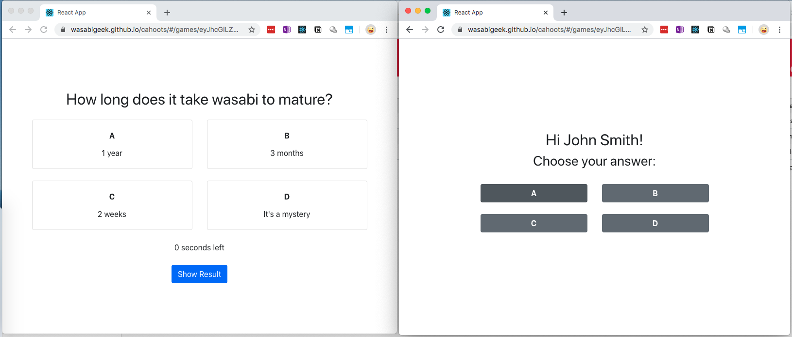
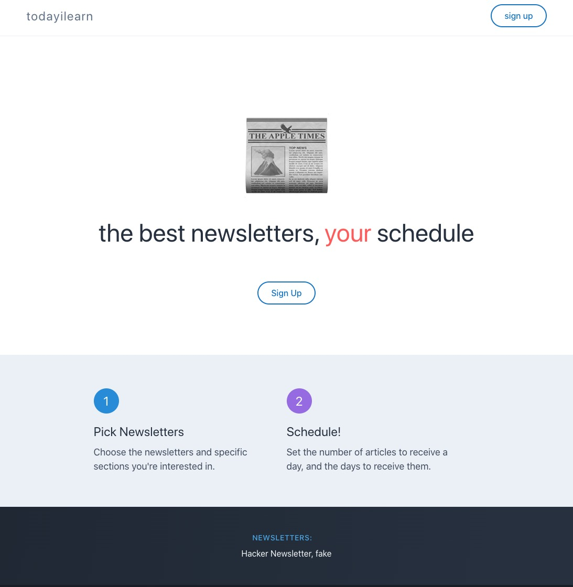

Reflections on side projects this year.

## Overall

- **I tend to build first (out of technical interest or my own personal problem), then make only half-hearted efforts to validate and abandon them quickly.** There's two takeaways for me: I should make a proper effort to get better and more comfortable with customer discovery and idea validation, and if it's to validate an actual business I should do that before building. Will be trying out [some](https://twitter.com/PierreDeWulf/status/1329765206256455683?s=20) [suggestions](https://www.indiehackers.com/post/how-do-you-create-a-product-people-want-to-buy-a28b69ebb3) around that.
- **The "technical" projects were great for personal learning, and fun (until they got serious)**. I still have a lot to learn and catch up in dev, so I think it's worth setting aside time for these. Maybe a dual-track thing - set aside 50% time to validate ideas, 50% time to improve technically? Or maybe I should try to capitalise on the learnings e.g. teaching others?
- **I abandoned some projects once it became clear they took more effort than expected, so I didn't see myself making money from them soon**. Perhaps in addition to the "dual-track" approach, the ideas I should try to validate first should be more around "simpler, one-time sale" products as [Rob Walling suggests](https://robwalling.com/2015/03/26/the-stairstep-approach-to-bootstrapping/). That might take off some pressure on pure-tech projects so I can go deeper.
- **I get quite discouraged and annoyed with design**. I am trying to get better at it for my Dec project, but not in a particularly structured manner. I do think it'll be useful, just not sure if I should be prioritising that over other things.

---

## Mar 2020

### A "self-hosted" Kahoot! clone

- In March, I helped out at a church event where we found out Kahoot had unexpectedly restricted the free plan. I thought it'd be cool if there could be a "self-hosted" version for non-profits, and made a really non-user-friendly-but-free prototype with GitHub Pages / React / Airtable
- It had some real UX deficiencies to make it free for me to host, so I wanted to have some testers to see if the tradeoffs were ok before deciding to promote it
- I asked a friend to try it but didn't really follow-up, and also made a post on Reddit (r/react), more a technical post (not much interaction there though)
- Reflections:
    - it was fun to give the Airtable API a try, also a good opportunity to get a little more familiar with Promises
    - I definitely didn't feel comfortable promoting the initial version of the project, there were so many hoops someone had to jump through just to even try it (setting up a throwaway Airtable account for example). In hindsight, this was probably a mistake - these are all guesses >_<

---

## Apr 2020

### A newsletter scraping project

- There were some really useful newsletters I had been following, but I wished there was a way to consume the articles shared in a more piecemeal manner. For example, Hackernewsletter includes >50 articles each week, I usually end up opening 15 tabs in my mobile Firefox and then slowly consuming them over the week - which you can guess isn't very successful.
- Spent a week or two repurposing an old project and started scraping the web archives of Hackernewsletter. (I later found out that Hackernewsletter had stopped publishing their archives, so that wouldn't really work)
- Showed the idea to a friend, who gave some really useful feedback (being able to retrieve the knowledge when it would be useful was a bigger problem than consuming it)
- Also, I couldn’t think of a way to give due credit back to the newsletter creators, unless I worked directly with them (feels like a chicken and egg thing) and I didn't want to disrupt their income source.
- Reflections:
    - The turnaround time was pretty OK (2 weeks) so not a huge loss
    - However, I probably should have led by talking to more people instead of building the backend first - since it was mostly repurposing I didn't really learn anything new from the technical standpoint
    - Also, I didn't really pursue the knowledge surfacing problem that he raised, because it was pretty nebulous and I was... lazy. Looking at the emphasis on knowledge management solutions now, it does seem like that was another mistake 😞

---

## Jun 2020

### A ~~"self-hosted"~~ real-time Kahoot! clone

> This actually still works, feel free to give it a [try!](https://wasabigeek.github.io/cahoots/#/)

- I thought it would be an interesting technical exercise to try and make the previous project real-time. Wanted to try something more DIY like socket.io, ended up using Firebase.
- I didn't really do much validation except showing it to 2 friends, with a lukewarm response
- I also decided against pursuing it further in it's current form:
    - Competing with Kahoot! on price was probably not going to work, their plans were still pretty affordable (and it seems, even cheaper now)
    - They were focusing on education, so I thought another angle was a casual party game, which incidentally was how I was introduced to Kahoot. Something like an [MMO bishi-bashi](https://en.wikipedia.org/wiki/Bishi_Bashi). I shelved this for a future date because I felt like I didn't have the expertise for building web games, so it would be a long-build.
- Reflections
    - Even if it wasn't exactly what I initially wanted to learn (Firebase abstracted a lot of the real-time aspects), I did walk away with some more knowledge of NoSQL databases, plus some Firebase-specific knowledge (e.g. security rules), which was great.
    - Again, didn't really push on the validation front, possibly because I felt it needed more polish, plus I wasn't sure if I was going to stick with Firebase if moving to the variety-game idea
    - I do feel like the rise of games like Fall Guys and Among Us somewhat validates the MMO casual game... 🤔

---

## Jul 2020

### Over the Kit

> This is still alive! [https://wasabigeek.github.io/drumz/](https://wasabigeek.github.io/drumz/)

- Me being a very lazy drummer, just want to be given some licks to practice instead of having to orchestrate and build patterns up to speed myself
- Built a small, limited prototype (only 4/4, only 16th notes 1 bar fill) then tried to do some validation
    - Posted on Reddit r/drums, relatively speaking there was very little interest (few upvotes and comments compared to what seems to usually trend there)
    - Pinged 3 musician friends - feedback was more in the “oh this is cool” sorta vein (I need to dig up those messages)
- Made some upgrades (the biggest being multiple usages: part-bar, 1-bar, 1-bar 16th note triplets variations)
- Reflections:
    - I used Vexflow and WebAudio, which was really interesting
    - r/drums might not be the right subreddit, given the focus there seems to be showing off 😋  maybe I should try r/drumming (which has less people but seems more educational) or see if there are some groups / chats I can join to talk with people

---

## Aug 2020

### HabitStar

> I never made it to releasing on the App Store, but some screens of the prototype still exist on [Makerlog](https://getmakerlog.com/tasks/305538)

- The thought process was something like, I've always wanted to try to build a mobile app + mobile apps seem to make a nice indie hacker project (could push infra to Apple via saving on device/iCloud, so it sounded like it'd be easier for one person to maintain than a web app)
- Initially thought to convert Over the Kit to an app, but after working with and digging into React Native for a bit, it seemed like it would be a challenge (due to Javascript's event loop), so I thought I'd start with something simpler
- I always wanted to make a habit tracker, because the one I was using still felt a little clunky
- Got a little bogged down trying to (i.) make a design I liked; (ii.) figure out the gamification mechanics (which I wanted to have in order to differentiate it). My lack of experience around mobile development and React Native (data storage, testing and debugging) made the experience slow and frustrating at times as well.
- At one point I was wondering whether to set the gamification part aside for a bit to just focus on getting the app out. But I thought the gamification was part of the charm, and didn't want to release without it (the $99 developer fee also was a small discourager)
- In the end, I just drifted to something else...
- Reflections:
    - The design part especially seemed to bog me down mentally ("I wish it looked better"). Maybe I shouldn't let myself get too discouraged with a sub-standard design. Or maybe I should try to get more comfortable with design?
    - I'm sure the "slow and frustrating" feeling contributed to me drifting away - but I should actually try to get used to being in that zone more, because it probably means I'm doing something way out of my comfort zone and learning something new.
    - I finally got to try React Native after thinking about it for years, so that was great! I do wonder if the tooling around Flutter is better though, maybe will give that a bit of a try. If it leans towards the game aspects more too, I wonder if I should try something like Unity 🤔  All of the above sound like pretty significant time commitments.

## Aug/Oct 2020

### ClassCal

> Still a work in progress, there's a [staging app](https://classcal-staging.herokuapp.com/) you can try, plus a quick and dirty wix landing page my friend made [https://www.classcal.com/](https://www.classcal.com/)

- Discussed a few ideas with a friend before we decided to give a Tuition scheduling app a try, based on some earlier conversations he had while validating a different idea. For me, I was also curious about whether we could work together, since he had some experiences starting more traditional businesses, and seemed to be stronger in the sales aspect.
- In terms of validating the idea:
    - my friend did some demos with existing solutions in the market - we thought a possible angle was to try to do something more affordable and SaaS-like, since the incumbent solutions in the market were positioned more as custom solutions, with prices to match (though they could qualify for the govt. grants)
    - we spoke with 2 of his contacts in the industry, the second one was positive but also seemed to have a non-traditional approach to the business, managing it more like a gym with online bookings and payments
    - we tried to walk the ground and speak with some tuition centres, but this was super hard. Most people just shoo-ed us away (to be fair, it was true that they were busy)
    - my friend also tried to post a poll in a Facebook groups, there was little response
    - now we're trying Google Ads with the landing page in a last-ditch attempt to get people to talk to and learn from, before we decide whether to move on to a different idea
- We agreed not to build anything beyond a Figma prototype until we had more validation, but I had itchy fingers by October and went to start on the app. It was a nice chance for me to figure out how to build a SaaS in Rails as well (I had tried some out-of-the-box template with the newsletter idea but it was not well-documented and I didn't know enough / need all of the bells and whistles)
- Reflections:
    - I think it’s worth spending time aligning with a partner on approaches and beliefs. Personally,  I realised I didn’t really know how to explain processes I had taken for granted, such as user story mapping.
    - It was helpful having the second brain, we weren’t always on the same wavelength but it did push me to have a different perspective and read up stuff I’ve been putting off e.g. on validation
    - I think I will still continue building for a bit, because it does provide a potential future framework for launching other projects. In the worst case, I will open source it and try to do some walkthrough to building a SaaS in Rails.

---

## Sep 2020

### PeekPalette

> The unfinished [landing page](https://wasabigeek.github.io/peekpalette/) is still up

- While doing the Figma prototype, I spent quite a bit of time figuring out colour variations and thought, there must be an opportunity here - an app that would generate and let you preview colour combinations against a UI (something like Headlime, but for UI colour palettes)
- I decided to try starting from a landing page and validate that first. After spending a week on an interactive hero section, I realised I didn’t know what else to put in the “marketing” section of the site that would be convincing >_<
- In terms of validation, I did a half-hearted post on Makerlog and another on IndieHackers, again, very little feedback or interest.
- Also thought that the target might be so niche it didn’t exist: If I’m a dev that wasn’t good with design, I’d probably purchase some theme instead.
- I do think there’s some opportunity in this market, but this probably wouldn’t cut it as a standalone product
- Reflections:
    - I did enjoy working on the hero section, got to try out a rainbow CSS gradient I saw on another blog
    - I didn’t enjoy trying to figure out the design of the UI on the interactive element, and also figuring out the marketing copy. That’s also probably the point when I started to realise the idea didn’t have legs. In this case, might have been helpful to validate more first before building, but I think I did ok here, didn’t “waste” too much time.

---

## Dec 2020

### BaseUI (working title)

- Continuing the theme of “I wish there was an easier way to do a nice design”, I’m currently trying to validate whether my problem of getting a decent but still unique design done quickly applies to other IH devs:
    - Inspired by the Mom Test, I tried not to rush into building, but tried to understand the target's (IH devs) current workflow a bit more with a post on IH [https://www.indiehackers.com/post/serial-saas-devs-whats-your-workflow-when-starting-a-new-project-7d4c43a2a3](https://www.indiehackers.com/post/serial-saas-devs-whats-your-workflow-when-starting-a-new-project-7d4c43a2a3) (it was also useful for me)
    - I looked at other solutions in the market: full-app templates like JumpstartPro and pure UI component libraries like TailwindUI, thought there might be an opportunity to do something in the middle.
    - I'm now trying to build (oops) a [free, minimal set of components](https://github.com/wasabigeek/rails-templates/tree/main/base_ui) that's integrated with Rails, and seeing whether there's interest in that before going further. Again, struggling a little with design here (I would love to just plonk TailwindUI in there, but it goes against their license, and I'm not sure if there's a cheap way to get a neat set of components)