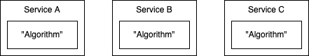

>Coupling is always with respect to a particular change

The above statement by Kent Beck (see ~14:00 [here](https://youtu.be/3gib0hKYjB0?t=840)) had me re-evaluating my understanding of coupling (and by extension, cohesion). Coupling is usually described as something intrinsic and fixed: code is either coupled or not. This formulation, however, suggests some nuance: how coupled two elements are depends on the change needed.

## An Example: Extracting Twitter's "Algorithm"
Beth Andres-Beck solidifies this in another [blog post](https://blog.bethcodes.com/coupling-and-cohesion-how-musk-would-need-to-rearchitect-twitter) with a recent example: the difficulty of extracting and open-sourcing Twitter's algorithm. Beth observes that the difficulty is likely due to "the algorithm" being spread across multiple microservices.

Note that this doesn't mean that Twitter's services are poorly designed - in fact, Beth argues:
> With respect to different changes, Twitter’s system is already **highly cohesive** and **loosely coupled**. Twitter grew revenue 16% yoy last quarter. It has recently made obvious strides in reducing harassment & abuse on the platform. All of that involved hundreds of engineers safely evolving running software.

To illustrate, let's assume multiple microservices are involved in determining a user's feed:

In daily work, a dev working on Service A would have been able to make modifications without touching other services. From that perspective, the services were loosely coupled.

However, to extract out "the algorithm", all the services would need to be modified i.e. from this perspective, they are coupled.

What I took away from this:
- not all coupling is discernible from the code - observe what needs to be modified to satisfy new changes or requirements.
- coupling is difficult to completely eliminate from a large system - it is a tradeoff, not a fixed property.
- refactoring is important - it helps us change our coupling tradeoffs.

## Not all coupling is discernible from the code
In Kent Beck's talk, he also mentions that the most expensive couplings are the ones "you don't see". His [example](https://youtu.be/3gib0hKYjB0?t=1473) is somewhat extreme: a change in the backup schedule of an application blocked connections and starved other applications on the same server rack.

John Ousterhout[^1] gives a more relatable example - changing the background colours in a website. If the colours were defined in an inline style on each page, a developer would need to modify all pages. Yet, this coupling (Ousterhout refers to this as "complexity") isn't obvious from characteristics of the code itself - there aren't any shared dependencies.

[^1]: A Philosophy of Software Design, Chapter 2.3

My takeaway? When there are new requirements or changes needed, observe which code needs to be modified. Do you need to modify code in multiple modules or services? That is a sign that they are coupled with respect to that change, and may need to be refactored to make those modifications easier. In the background colour example, this might mean some central variable to control the colour (you could argue this introduces a coupling to that central stylesheet).

## Coupling is difficult to completely eliminate from a large system
Following on from the server rack example, Kent Beck emphasises that the bigger and more complex the system, the more likely you'd find "weird, action at a distance coupling".

Even if we break our logic into small, composable parts, those parts need to be combined and orchestrated. This gets repeated at multiple levels in software (from modules to services etc.), creating coupling based on how those parts are composed.

The Twitter example shows that a choice was made to decouple a certain "axis", spreading the generation of a user's feed across multiple services. This allowed the company to iterate and evolve quickly, with the tradeoff that it was difficult to extract and isolate the algorithm as a whole.

So perhaps it's worth thinking of coupling as a tradeoff, rather than a fixed property. We decide certain changes are more important to enable today and decouple along those axes, knowing the result could still be coupled from certain perspectives.

## Refactoring is important
Earlier, I chose to emphasise observation of changes over speculation, because it's very easy to get it wrong and cause more harm than good. It's more important to be able to adapt, and that's why it's important to get good at refactoring. To quote Kent Beck from [elsewhere](https://tidyfirst.substack.com/p/tldr-coupling-and-later-cohesion/comment/4965495?s=r):

> You might be able to guess that I care less about predicting the future than in doing a good job with the present and adapting flexibly to learning and surprises.

 I'll lean on Beth Andres-Beck's example again, where he too invokes YAGNI (you ain't gonna need it):

> Imagine that Twitter had guessed that a billionaire would get mad about an ad they showed him. They might have spent a similar amount of time & effort as this project will take today making the ad targeting logic cohesive & decoupled. The code still wouldn't be any more cohesive or loosely coupled with regards to the change that \[Elon Musk\] actually wants. It would have cost a bunch of money to do, making all the other work over the years harder, and it still wouldn't make this change any easier.
>
> Attempting to anticipate the future doesn't help us build systems that can adapt to it.

So, prioritise getting good at (1) observing the system to identify coupling and (2) knowing how to refactor safely, rather than getting better at speculating future requirements. Refactoring should be seen as an essential part of our toolbox for attaining "low coupling and high cohesion".

(Note that the above refers to _guessing future requirements_, as opposed to the requirements themselves being speculative. I think the latter is somewhat true most of the time - you don't truly know if a feature is going to be a success until it's out in the wild.)

## Afterword
This was pretty abstract. I hope to revisit this with more concrete, personal examples. Also, few things are truly black-and-white in software design - let's see if I still agree with these takeaways or develop more nuance as time progresses.

In the meantime, I'd love to hear your thoughts and discuss further - feel free to tweet or leave a comment!

