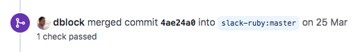

Around the start of the year, I set a goal to start contributing to Open Source. The motivation was to experience different coding styles and improve my employability. After a good half a year, I feel reasonably comfortable stating that I've contributed to Open Source. I've summarised the journey in the hope that it might be benefit someone who's looking to take their first step into the world of Open Source.

## First Timers Only

I remembered reading about a [first timers "movement"](https://kentcdodds.com/blog/first-timers-only) and quickly found a compilation of [projects](https://github.com/MunGell/awesome-for-beginners) that supported the movement. Ruby was what we used at work, so I jumped to that section.

The first [PR](https://github.com/rails/rails/pull/38220) I tried to submit was for Rails (seemed like it would be something nice on the resume). Rails uses the label [good first issue](https://github.com/rails/rails/labels/good%20first%20issue), so I picked an issue near the top, spent a Saturday working and submitted it!

Then I waited.

And waited.

## Good things...

In hindsight, that issue was not a great first pick. It already had some attempts, with the most recent just over a week from when I made the PR. I think I was just so unsure of myself, I wanted to try it anyway to see if I could actually do this thing. If I screwed it up, there were already a few attempts anyhow.

In the end, one of the maintainers took it upon himself to close the issue and credited all the contributors. His PR was really a lot better, so I guess it was a way of navigating this long-drawn issue without stepping on any toes.

While waiting, I decided to try again. We were using a [tool](https://github.com/99designs/iamy) written in Go to manage our AWS IAM at work, but there was a good-to-have feature we wanted and an issue for it. So I spent a few week nights and weekends learning Go, doing up the [PR](https://github.com/99designs/iamy/pull/69) and submitting it.

Then I waited.

## ...come to those...

And someone reviewed! I was energised. I made some changes. Then he requested a second opinion from another maintainer.

It’s still there, open. **UPDATE 19 Jun 2020**: There was some movement! Seems like the reviewer was going to go ahead and merge without the blessing of the other. **UPDATE 20 Aug 2020** And then it went quiet again...  and now I see a merge conflict because the other maintainer merged something else 🤷

By this point I was quite disheartened. No hate to open source maintainers, it’s pretty thankless work and the world is better for your contributions. Still, it *was* disheartening.

## ...who wait.

I flapped around a bit, and one day decided to look at another gem our company had been using. I saw a pretty steady stream of merges, neatly labelled issues, plus it just felt less intimidating than Rails.

A few days later, my [first merge](https://github.com/slack-ruby/slack-ruby-bot/pull/244)! I was elated.

Huge props to [dblock](https://github.com/dblock), who somehow manages to turnaround and reply quickly, often within a day or two. Rubyists, if you would love to contribute but don’t know where to, might I humbly suggest anyone of dblock’s projects - it’s a great place to start.

## Closing Thoughts

My takeaways (sample size of 1, take with a pinch of salt):
- **Would-Be-Maintainers**: Labelled issues were very helpful to me, I think it would make it a lot easier to get new contributors when issues are triaged and labelled (especially with a `first-timers-only` type label).
- **Would-Be-Maintainers**: In the absence of timely review, any comment helps, a lot. I know it's unfair to expect you to be devoting loads of time as a maintainer, especially if it's a project you don't use anymore. I can only speak from my experience as a contributor - it made a huge difference in motivation.
- **Would-Be-Maintainers**: Keep an eye out for new maintainers to share your burden. Easier said than done, so maybe I'd best refer you to [dblock](https://github.com/dblock). I feel he does this well - after contributing for a few months, he reached out and asked if I would like to be a contributor on one repo, to reduce the bus factor.
- **Would-Be-Maintainers**: Have a `CONTRIBUTING.md` documentation. Rails was pretty amazing for this, I was kinda worried about the setup but they even had instructions on how to use Vagrant to get started. It helps newbies!
- **Would-Be-Contributors**: Expect a little trial-and-error to getting your first PR merged, but stick with it! I found the experience super rewarding, and indeed got exposure to different coding styles (and even a new language).
- **Would-Be-Contributors**: Make life as easy for maintainers as possible - try to figure out as much as you can first, whether it's looking at previous PRs, making GitHub checks pass.

I hope that was helpful! Feel free to drop a note to discuss / disagree :)

