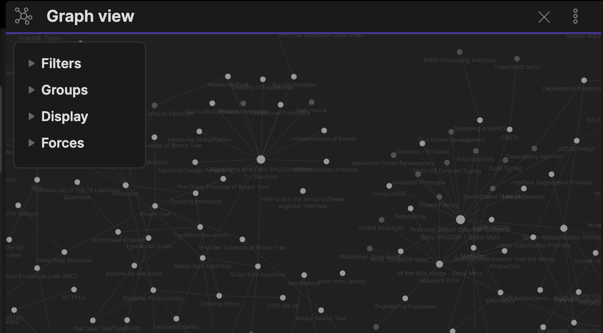
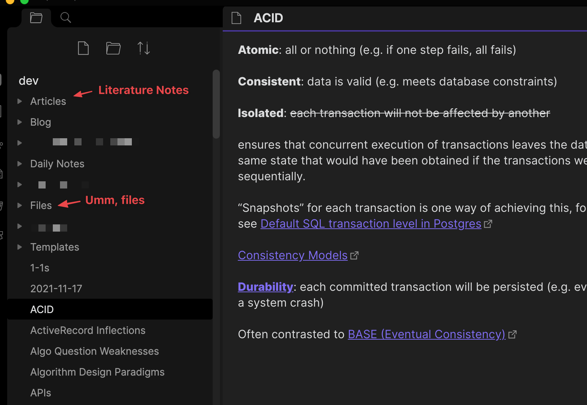
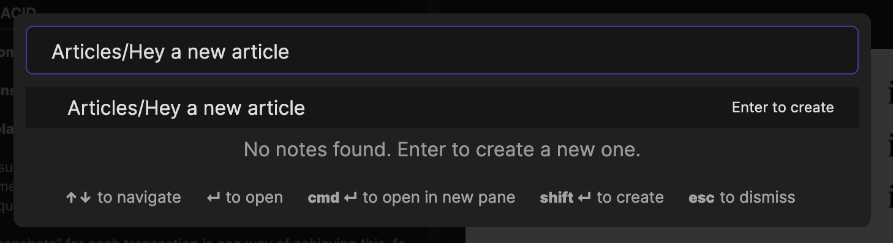
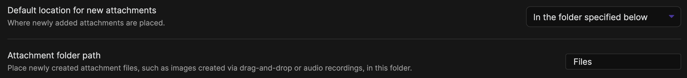
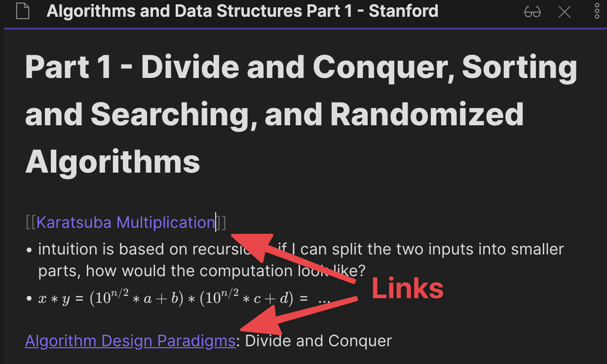
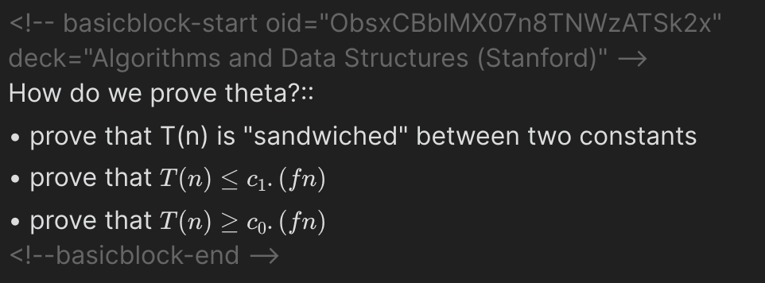

I've been working through a Data Structures and Algorithms course on Coursera recently, and it's been a great opportunity to reflect on where I am in the "meta" of learning. I'll first talk about various resources and frameworks which I've found helpful, before walking through an example workflow.

## tl;dr

- take notes in Obsidian, breaking out into small, atomic ideas and concepts a la Zettelkasten
- write questions and add to Anki via an Obsidian plugin
- (try to) test myself with spaced repetition via Anki
- remind myself to have a growth mindset

## Zettelkasten

This is a [system of note-taking](https://en.wikipedia.org/wiki/Zettelkasten) that is often mentioned together with Niklas Luhmann, who had a massive knowledge base ([90,000 index cards](<https://en.wikipedia.org/wiki/Niklas_Luhmann#Note-taking_system_(Zettelkasten)>)) and credited the system for helping him write profilically. He wrote more than 70 books and nearly 400 scholarly articles!

After multiple failed attempts at starting a hierarchical knowledge base, I've found this approach _freeing_. Previously, I often got stymied by categorisation - what title should I give this note so it's searchable? Which folder should it go into? Should I be using a tag instead?

Zettelkasten obviates much of that pain by eschewing hierarchical knowledge bases, favouring small, "atomic" notes with connections between them i.e. think graphs, not folders. When you need to research something for writing, you can follow your trail of connections to find related info or unusual connections. I think this model maps a lot closer to the brain - after all, we draw metaphors or parallels from other disciplines, and may find ourselves often having to recategorise information (especially when learning something new).

A related workflow I've adopted is a "pre-processing" step of first taking "literature" notes before converting to "permanent" notes. I think this is from How to take Smart Notes Summary - Fortelabs, though I first heard of this while watching a video by [Shu Omi](https://www.youtube.com/watch?v=rOSZOCoqOo8).

Resources:

- Shu Omi has good [introduction](https://www.youtube.com/watch?v=rOSZOCoqOo8) videos
- [Luhmann's writeup](http://luhmann.surge.sh/communicating-with-slip-boxes) on Zettelkasten

## Tool of Choice: Obsidian

I first attempted to maintain a Zettelkasten knowledge base in [Notion](https://www.notion.com), because:

- one-app-to-rule-them-all: I was already using it as a goal setting and project management tool
- it had a mobile app, web clipper and a pleasant UX
- you could (tediously) link various pages together, and they later introduced backlinks

Ultimately, I moved over to [Obsidian](https://obsidian.md/), which had less polish but was better in one crucial aspect; I was able to work _faster_ in it:

- building connections between notes was trivial (two square brackets), while it took a few seconds to search for or create a new note in Notion
- searching for a note was much faster, because it's local first and there is a keyboard shortcut to search by title (Notion defaulted to including page text, which
- slowed down search considerably)

What Obsidian also had going for it:

- notes are stored as markdown files; which I thought might be easier to work with if I ever wanted my knowledge base to be public (i.e. a digital garden). There's also Obsidian Publish to consider.
- has a burgeoning plugin system, in particular I wanted to be able to do spaced repetition (see next section)

Other tools I've tried:

- [Roam](https://roamresearch.com/) - arguably one of the first movers in "graph" knowledge bases, but was clunky when I first tried it plus it got expensive.
- [Remnote](https://www.remnote.com/) - has built in spaced repetition (see next section) but I found setting up repetition to be a bit unintuitive, and it had no mobile app.

(Fun aside, this post was brewed 🍺 in Obsidian!)

## Learning How to Learn (Coursera)

This was a [Coursera course](https://www.coursera.org/learn/learning-how-to-learn) I audited last year, and while it felt a bit disjointed, I had a lot of useful takeaways, in particular:

- _not_ actively thinking about a problem can actually help you come up with solutions (diffuse thinking)
- testing yourself + space repetition is **super effective**, better than blindly re-reading notes etc.
- memory techniques: chunking, analogies and metaphors
- exercise and sleep help you think better

How I've tried to apply this:

- learnt to appreciate doing "nothing", especially when working on a problem requiring creative thinking
- wrote questions and used an Obsidian plugin to sync them to Anki, so I could test myself with spaced repetition. (The "tried" qualifier is important, as in practice this has required quite a lot of effort and discipline 😊)

## Mindset

I had a surface understanding of what a "growth mindset" was, but learnt this year that I hadn't applied it in my daily life. Self-doubt has been a constant struggle for me the past few years, and it sometimes manifests as bouts of "why bother if I'm not cut out for it", i.e. a fixed mindset. Reading [Carol Dweck's book](https://play.google.com/store/books/details/Mindset_The_New_Psychology_of_Success?id=fdjqz0TPL2wC) has helped me become more aware of when I've been having a fixed mindset, and take steps to shift to a growth mindset. I regret not reading it earlier.

The fixed mindset reared it's head a few times over the course. At the beginning, I had contemplated giving up after struggling to understand some big-Oh proofs. Most recently, I struggled with self-confidence after failing the weekly problem assignment. Thankfully, I stuck with it, mostly on the thinking of "well, at least I'll learn something". Personal vindication came was when I was able to understand how to solve all of the questions in the final exam (albeit I still had to take it twice, due to some misreading and miscalculation).

It's not a perfect book by any means - I've found it repetitive and generalising at times - but it's been more effective at helping me apply the concepts than watching explainer videos or reading articles.

## An Example Workflow

My current (~6 months old) Obsidian knowledge base looks mostly like this, with a few top level folders:

- **Articles** - where I store my literature notes. I named it "articles" since it was shorter, which makes it easier to add a note via Obsidian's quick switcher:
  
- **Files** - let me state the obvious that files go here, it just makes my root directory cleaner. I don't bother with subfolders, relying on the backlinks (connections) to find stuff. There's a useful setting to automatically add all pasted files to this folder:
  
- **Blog** - is where I record ideas for posts and start drawing connections with the rest of the knowledge base.
- **Templates** and **Daily Notes** are plugin-related, and mostly for what they say (though I still ended up doing most of my journalling in Notion)
- The rest of the folders are mostly there from earlier experiments, I will move the stuff out of there... _someday_ 🏃.
- _All_ other notes ("permanent" notes) go into the root directory, yay!

So the workflow for this course was:

1. Create an Article for my "literature notes" in the course
2. While taking literature notes, create placeholder notes (or link to existing notes) for individual concepts that seem useful or I want to go deeper into:
   
3. Where relevant (or when I realise I don't know something after failing a weekly assignment), I create a question and sync Anki flashcards via this [plugin](https://github.com/debanjandhar12/Obsidian-Anki-Sync):
   
4. Occasionally I'll revise the flashcards, either via the Anki desktop app or the web app on mobile (good enough 🤷‍♂️ there are other options)

My knowledge base is still pretty small, it will be interesting to see whether this still holds up over time. I'm also not very disciplined with regularly going through the base to build connections, but I think that's also part of it's beauty - minimal process and mental overheads.

What is your learning workflow?
