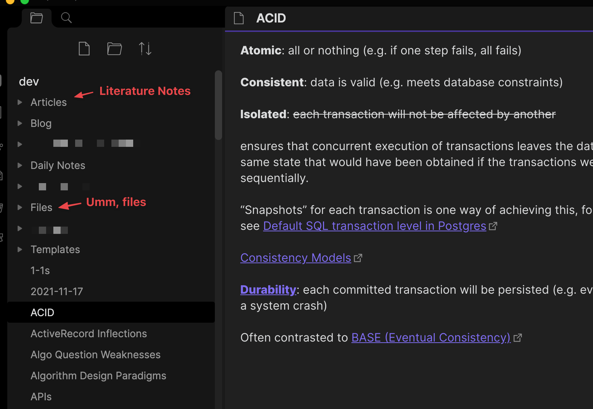
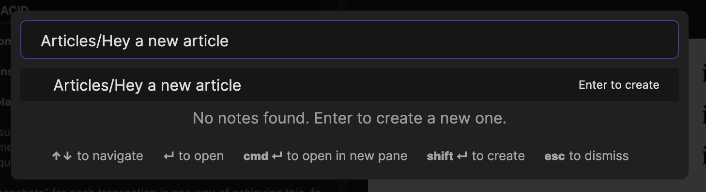
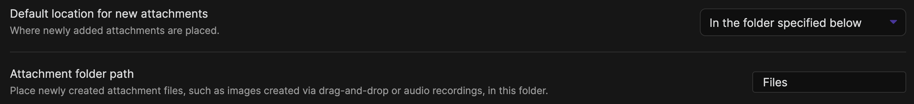
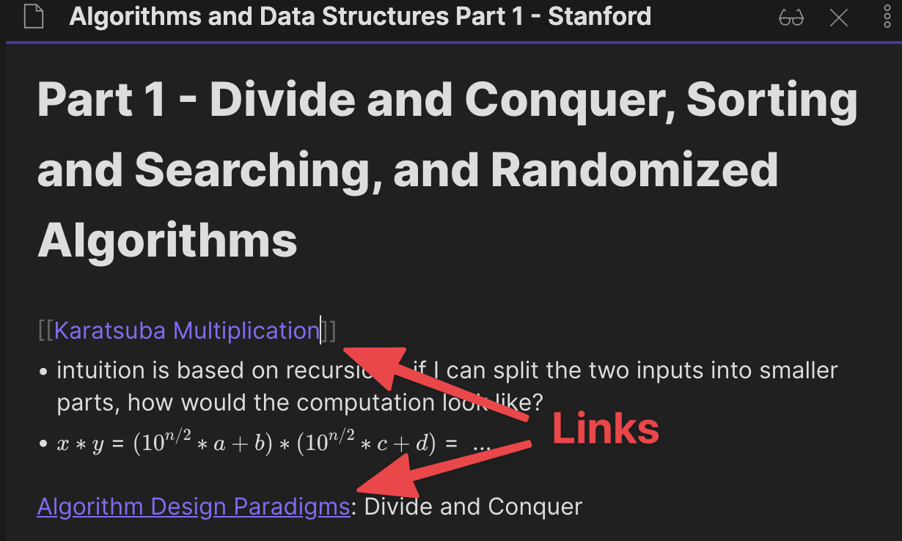
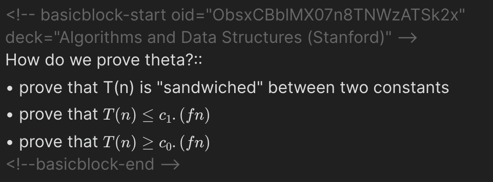
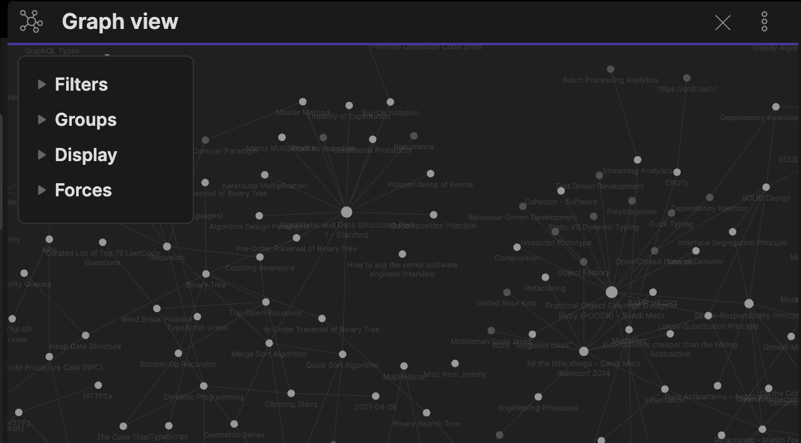

I've been working through a course on Coursera recently, and it's been a great opportunity to reflect on where I am in the "meta" of learning. This post walk throughs my current workflow before diving into the context behind it.

## 1. The Workflow
The workflow is loosely based on Zettelkasten, with a little thrown in from a "Learning to Learn" course I audited last year. I'm currently using two tools: **Obsidian** for note-taking, and **Anki** for testing myself / spaced-repetition. More on these in later sections.

My Obsidian knowledge base is about 6 months old (I've yet to migrate my older knowledge base) and looks like this, with a few top level folders:
	
- **Articles** - where I store my literature notes (explained later). I named it "articles" since it was shorter, which makes it easier to add a note via Obsidian's quick switcher:
	
- **Files** - let me state the obvious that files go here, it just makes my root directory cleaner. I don't bother with subfolders, relying on the backlinks (connections) to find stuff. There's a useful setting to automatically add all pasted files to this folder:
	
- **Blog** - is where I record ideas for posts and start drawing connections with the rest of the knowledge base. (Fun aside, this post was brewed 🍺 in Obsidian!)
- **Templates** and **Daily Notes** are plugin-related, and mostly for what they say (though I still ended up doing most of my journalling in Notion)
- The rest of the folders are mostly there from earlier experiments, I will move the stuff out of there... _someday_ 🏃.
- _All_ other notes ("permanent" notes) go into the root directory, yay!

And the workflow for this course was:
1. Start a literature note in Articles for general note-taking
2. While taking literature notes, create placeholder notes (or link to existing notes) for individual concepts that seem useful or I want to go deeper into:
	
3. When I want to internalise something (happens often after failing a weekly assignment 😆), I create a question and sync Anki flashcards via this [plugin](https://github.com/debanjandhar12/Obsidian-Anki-Sync) (having a bit of issues rendering Latex though):
	
4. Occasionally I'll revise the flashcards, either via the Anki desktop app or the web app on mobile (good enough 🤷‍♂️ there are other options)

## 2. The Context
Next I'll go deeper into my influences.

### Zettelkasten
This is a [system of note-taking](https://en.wikipedia.org/wiki/Zettelkasten) that is often mentioned together with Niklas Luhmann, who had a massive knowledge base ([90,000 index cards](<https://en.wikipedia.org/wiki/Niklas_Luhmann#Note-taking_system_(Zettelkasten)>)) and credited the system for helping him write prolifically. He wrote more than 70 books and nearly 400 scholarly articles!

After multiple failed attempts at starting a hierarchical knowledge base, I've found this approach _freeing_. Previously, I often got stymied by categorisation - what title should I give this note so it's searchable? Which folder should it go into? Should I be using a tag instead?

Zettelkasten obviates much of that pain by eschewing hierarchical knowledge bases, favouring small, "atomic" notes with connections between them i.e. think graphs, not folders. When I need to reference something, it's often easier to find because each note is generally a cohesive topic ("atomic"), and the trail of connections make it possible to find related information or unusual connections. I think this maps a lot closer to the brain - after all, we draw metaphors or parallels from other disciplines, and may find ourselves often having to recategorise information (especially when learning something new).

A related workflow I've adopted is a "pre-processing" step of first taking "literature notes" before converting to "permanent" notes. I think this is from [How to take Smart Notes](https://takesmartnotes.com/), though I first heard of this while watching a video by [Shu Omi](https://www.youtube.com/watch?v=rOSZOCoqOo8).

Resources:
- Shu Omi has good [introduction](https://www.youtube.com/watch?v=rOSZOCoqOo8) videos
- [Luhmann's writeup](http://luhmann.surge.sh/communicating-with-slip-boxes) on Zettelkasten

### Tool of Choice: Obsidian
I first attempted to maintain a Zettelkasten knowledge base in [Notion](https://www.notion.com), because:
- One-app-to-rule-them-all: I was already using it as a goal setting and project management tool.
- It had a mobile app, web clipper and a pleasant UX.
- You could (tediously) link various pages together, and they later introduced backlinks.

Ultimately, I moved over to [Obsidian](https://obsidian.md/), which had less polish but was better in one crucial aspect; it was easier to adopt a Zettelkasten-influenced system:
- Building connections between notes was trivial (two square brackets), while it took a few seconds to just to search for or create a new note in Notion.
- Searching for a note was much faster, because it's local first and there is a keyboard shortcut to search by title (Notion defaults to including page text, which slows down search considerably).

What Obsidian also had going for it:
- Notes are stored as markdown files; which I thought might be easier to work with if I ever wanted my knowledge base to be public (i.e. a digital garden). My blog also uses markdown files, which made conversion pretty straightforward and automatable.
- has a burgeoning plugin system, in particular I wanted to be able to do spaced repetition (see next section).
- Local-first (fast, private) and E2E encryption if you pay for their sync service.

Other tools I've tried:
- [Roam](https://roamresearch.com/) - arguably one of the first movers in "graph" knowledge bases, but was clunky when I first tried it plus it got expensive.
- [Remnote](https://www.remnote.com/) - has built in spaced repetition (see next section) but I found setting up repetition to be a bit unintuitive, and it had no mobile app.

### Learning How to Learn (Coursera)
This was a [Coursera course](https://www.coursera.org/learn/learning-how-to-learn) I audited last year, and while it felt a bit disjointed, I had a lot of useful takeaways, in particular:
- _not_ actively thinking about a problem can actually help you come up with solutions (diffuse thinking)
- testing yourself + space repetition is **super effective**, better than blindly re-reading notes etc.
- use memory techniques to help understand and remember: chunking, analogies and metaphors
- exercise and sleep help you think better

How I've tried to apply this:
- learnt to appreciate doing "nothing", especially when working on a problem requiring creative thinking
- wrote questions and used an Obsidian plugin to sync them to [Anki](https://apps.ankiweb.net/) (a spaced repetition tool), so I could test myself with spaced repetition. (The "tried" qualifier is important, as in practice this has required quite a lot of effort and discipline 😊)

### Growth Mindset
This doesn't manifest in the workflow or the tools I use, but it's had a massive influence in my learning journey last year. I had watched short videos on having a growth mindset before, but it was only after reading [Carol Dweck's book](https://play.google.com/store/books/details/Mindset_The_New_Psychology_of_Success?id=fdjqz0TPL2wC) that I started internalising it.

Self-doubt has been a constant struggle for me the past few years, and it sometimes manifests as bouts of "why bother if I'm not cut out for it", i.e. a fixed mindset. Going deeper in the topic via the book has helped me become more aware of my fixed mindsets, and enabled me to action on it. I regret not reading it earlier.

The fixed mindset reared it's head a few times over the course. At the beginning, I had contemplated giving up after struggling to understand some big-Oh proofs. Most recently, I struggled with self-confidence after failing the weekly problem assignment. Thankfully, I stuck with it, mostly on the thinking of "well, at least I'll learn something". There was some personal vindication when I realised I was able to solve all of the questions in the final exam (albeit I still had to take it twice, due to some misreading and miscalculation).

It's not a perfect book by any means - I've found it repetitive and generalising at times - but it's been more effective at helping me apply the concepts than watching explainer videos or reading articles.

## 3. Cautious Optimism
My knowledge base is still pretty small, it will be interesting to see whether this still holds up over time, especially as I start taking more courses and learning more things at work. I'm also not very disciplined with regularly going through the base to build connections, but I think that's also part of it's beauty - minimal process and mental overheads. Let's see how the rest of the year pans out!

What's your learning workflow?

