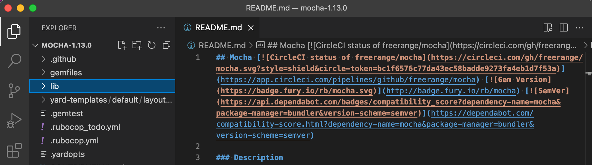
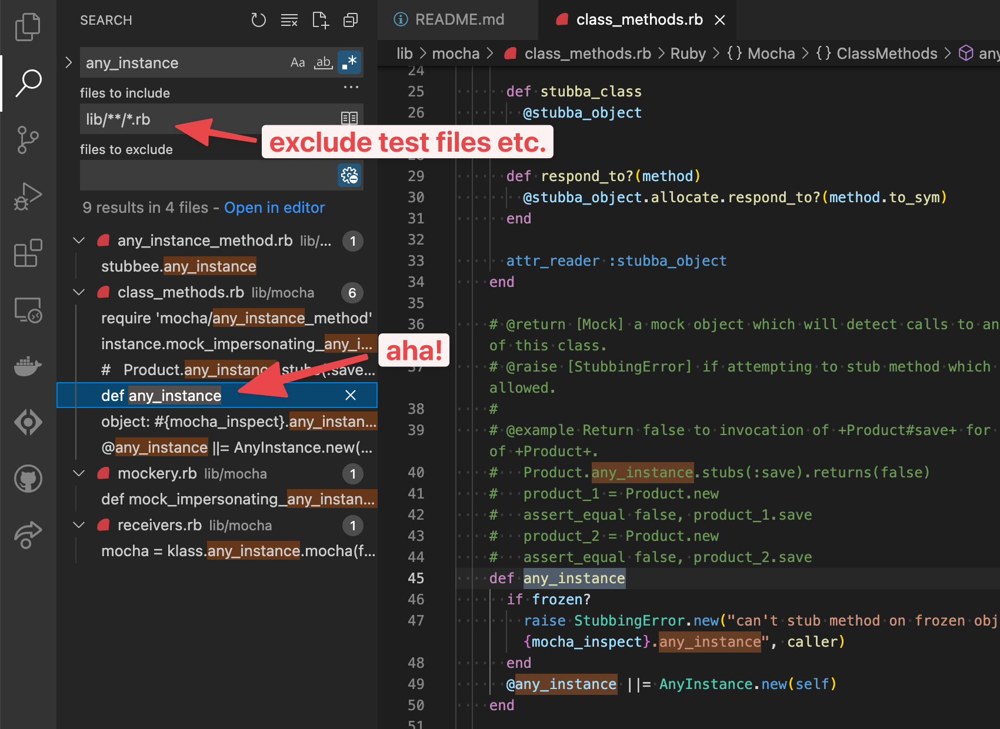
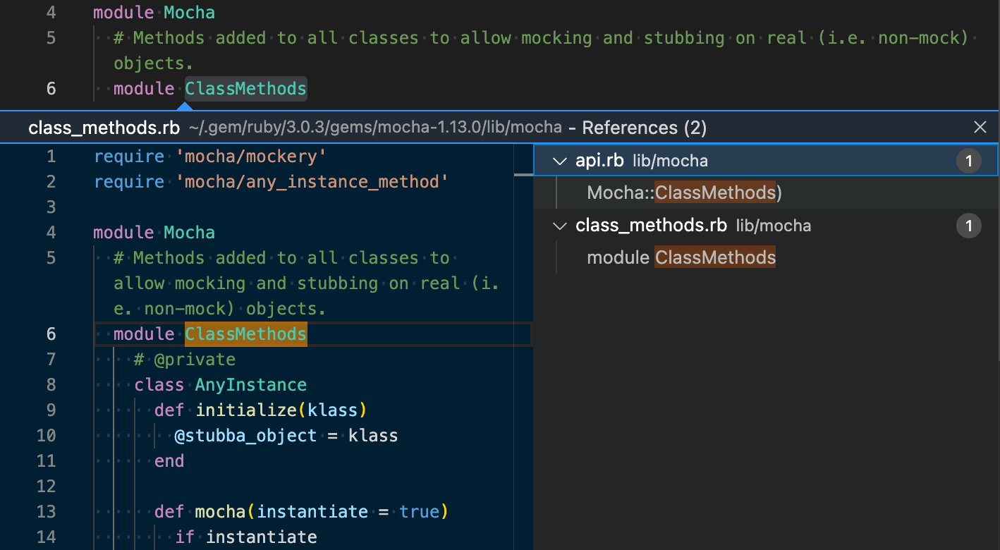

Whether out of curiosity or trying to understand a method for debugging, it's helpful to know how to dig into a Ruby gem. Recently I was curious over how [mocha](https://github.com/freerange/mocha/), a mocking library for minitest, allowed stubbing on `any_instance` of a Class (as opposed to injecting a stubbed object), for example:

```ruby
def test_stubbing_an_instance_method_on_all_instances_of_a_class
  Product.any_instance.stubs(:name).returns('stubbed_name')
  product = Product.new
  assert_equal 'stubbed_name', product.name
end
```

Following this are steps you can try when investigating a gem. I'd love to say these were the exact steps I took while investigating `any_instance`, but truth is some steps I discovered only while writing this post 😅. The steps are specific to using VSCode.

## Open the Source Code

Assuming the gem is installed, `gem open <gemname>` (or `bundle open <gemname>` if installed in a project via Bundler) will open it's source code with the command set in the `$EDITOR` environment variable.

For example `EDITOR=code bundle open mocha` from my project opens the gem in VSCode:



If the gem isn't installed, you could also look up the source code online ([rubygems.org](https://rubygems.org/)) and if the code is on GitHub, there's a handy [shortcut](https://twitter.com/github/status/1425505817827151872?s=21) to open it in a browser version of VSCode.

## Find your Target

One of the easiest ways to find the method definition is to use `#source_location`. Fire up an irb console:

```ruby
require 'minitest'
require 'mocha/minitest'
Object.method(:any_instance).source_location
# => ["/.../ruby/3.0.3/gems/mocha-1.13.0/lib/mocha/class_methods.rb", 45]
```

In case that doesn't work, since we have the source code open, we can make use of VSCode's search:



Some ideas to try if the results list is really long:

- prefixing the search term with the declaration syntax (e.g. `class <ClassName>` for a class, `def <method_name>` for an instance method) generally works well, but not always, given the many ways to metaprogram in Ruby. For example, it's not obvious that `any_instance` would have been defined as an instance method.
- "**Match Whole Word**" (ab) helps exclude classes / methods with the search term as a substring (e.g. it would have excluded `any_instance_method` and `mock_impersonating_any_instance_of` in the results above)
- "**files to include**" knowing the structure of most gems (see later section), we can usually restrict to the `lib/` directory, which will exclude test files, bin scripts etc

## Trace the Callers

While we found the method, it didn't answer our initial question, which was how `any_instance` becomes callable on any class. We could probably try a "top-down" or "bottom-up" search here.

For **"bottom-up" search**, since this is plain Ruby as opposed to Rails, we could try to follow the `require` trail. But if we have an extension like [solargraph](https://marketplace.visualstudio.com/items?itemName=castwide.solargraph), a simpler way is to make use of VSCode's **Go to References**:



Above, we find that `Mocha::ClassMethods` is included into Class in `Mocha::API`:

```ruby
Class.send(:include, ClassMethods)
```

We can continue doing the same approach, but at some point the "search tree" got quite unwieldy so I switched to a more **"top-down" approach**, checking the README to see how the gem was `require`-d.

## Know the Structure of a Gem

A quick detour on how a gem is structured - `lib/` generally contains the gem's core logic. There you'll find a ruby file and a folder corresponding to the name of the gem. For example, in `mocha`:

```
lib/
└── mocha.rb
└── mocha/
```

The ruby file (e.g. `lib/mocha.rb`) generally contains most of the gem's bootstrapping logic, as this is the file loaded when requiring the gem (i.e. `require 'mocha'` would load `lib/mocha.rb`). So typically we'd start our "top-down" search here.

`mocha` is slightly different - it supports multiple test libraries, and in the [README](https://github.com/freerange/mocha/#minitest-1) we are instructed to require a different file depending on our test library. For example, for `minitest` we'd do:

```ruby
require 'minitest/unit'
require 'mocha/minitest'
```

So in this case we'd start our search from `lib/mocha/minitest.rb`. There on it's pretty straightforward Ruby, leading us back to `Mocha::API` (albeit with knowledge of how it gets required!).

## Footnotes

- [How to Dispel Ruby Magic and Understand Your Gems (Justin Weiss)](https://www.justinweiss.com/articles/how-to-dispel-ruby-magic-and-understand-your-gems) - an inspiration for much of this
- [Structure of a Gem (RubyGems)](https://guides.rubygems.org/what-is-a-gem/) - more details on how a gem is structured, along with a quick start so you can build your own gem!
- VSCode docs on [searching across files](https://code.visualstudio.com/docs/editor/codebasics#_search-across-files)
