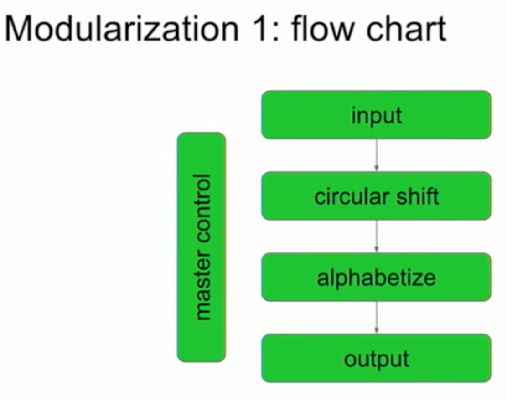
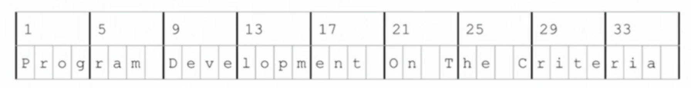
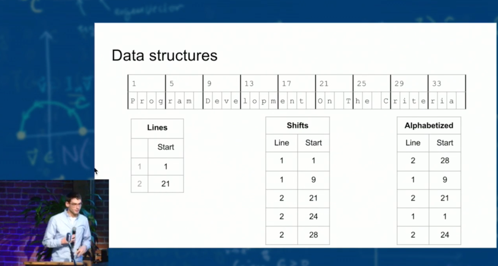
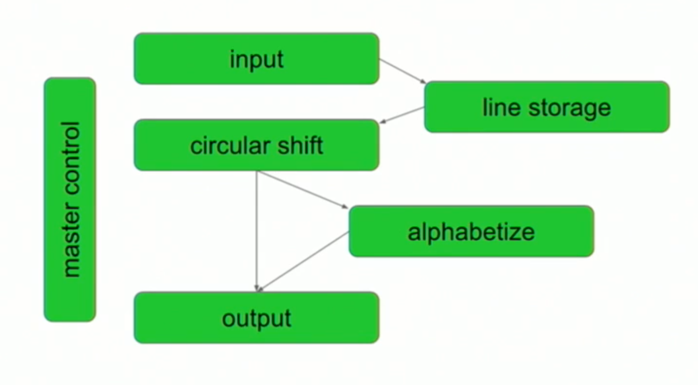

Robert Martin, who popularised SOLID, [specifically mentions](https://blog.cleancoder.com/uncle-bob/2014/05/08/SingleReponsibilityPrinciple.html) a 1972 paper as a major influence for the Single Responsibility Principle (SRP). That paper was the mouthful "**On the Criteria To Be Used in Decomposing Systems into Modules**", in which David Parnas compared two approaches for modularising (breaking code up into modules) a "KWIC Index" system. This is an attempt to explain the paper, which I had trouble understanding till I came across a video explanation by Diego Ongaro (start from [about 17:16](https://youtu.be/R7X4B3-k7g4?t=1036)). We'll look at the system, approaches and conclusions.

## The System: ~~KWIC~~ KWAC Index
KWIC (KeyWord In Context) and the demonstrated variant, KWAC (KeyWord Alongside Context), were indexing systems suited for technical manuals. KWAC "circularly shifts" the keyword such that it's the first word. For example, `Office 2003 Timesaving Techniques for Dummies.` would become `Dummies. Office 2003 Timesaving Techniques for`, as below:


## Modularization 1: "Flowchart"
In the first modularization, Parnas took a "flowchart approach" for breaking apart the modules:

In addition, there was a significant design decision to:
- have all modules share a common data structure for storing and accessing the input (this is not obvious from the above chart)
- the data structure requires all modules to have a low-level understanding of how it stores data (e.g. groups of characters in memory, with specific line breaks represented by spaces *and* a separate "line index").

Here's what each module does - feel free to skip ahead to "Modularization 2" and the "Comparison: Changeability" sections if you just want the bits relevant to SRP:
- **Input** 
  - Parses the input text file into something like an array, with 4 characters per element (explained around [23:36 in the video](https://youtu.be/R7X4B3-k7g4?t=1415)).
  - The above would be stored in memory.
  - For example, given the file:
  ```shell
  # cat input.txt
  Program Development
  On The Criteria
  ```
  - This would be parsed and stored as:
     
  - Module also outputs "Lines", which is an array stating the start of each line (e.g. 1, 21 above)
- **Circular Shifter**
  - Given "Characters" and "Lines", it outputs an array of "Shifts"
  - "Shifts" store the line number, as well as the starting index of each word
- **Alphabetizer**
  - Given "Characters" and "Shifts", it sorts the "Shifts" alphabetically and outputs them as "Alphabetized"
- **Output**
  - Given the "Characters" and "Alphabetized" shifts, output the KWAC index, something like:
  ```shell
  # Using Diego's example
  # go run m1/main.go input.txt
  Criteria | On The [2]
  Development | Program [1]
  On The Criteria [2]
  Program Development [1]
  The Criteria | On [2]
  ```

A helpful visual summary of all the different data structures: 


## Modularization 2: "Information Hiding"
In this modularization, Parnas abstracts how the input is stored via "Line Storage", and changes the dependency of subsequent modules so there's less global reliance on Line Storage:

The criteria for this decomposition was called "Information Hiding":
> Every module in the second decomposition is characterized by its knowledge of a design decision which it hides from all others. Its interface or definition was chosen to reveal as little as possible about its inner workings.

What each module does - again, feel free to skip ahead:
- **Input** - parses the input, but this time inserts it into a Line Storage
- **Line Storage** - think of it like an Object that has methods for:
  - inserting characters by line, word and character-in-word number (e.g. insert "A" into Line 1, Word 2, Character 5)
  - retrieving characters by line, word and character-in-word number (e.g. get Character 5 of Line 1, Word 2)
  - other convenience methods e.g. count of words
- **Circular Shifter**
  - generates the circular shifts from Line Storage, like Modularization 1
  - instead of outputting "Shifts", the module itself provides an interface similar to Line Storage, but operating by *shifts* instead of lines 
    - e.g.  for retrieving characters, get Character 5 of *Shift* 1 (instead of Line), Word 2
- **Alphabetizer**
  - From Circular Shifter, sorts and remembers the shifts, like Modularization 1
  - Instead of outputting the "Alphabetized" shifts, the module provides a method to get Circular Shifts in order (e.g. tell me the shift that's in the 2nd sorted position)
- **Output**
  - Uses Alphabetizer and Circular Shifter to generate the KWAC Index


## Comparison: Changeability
This is probably the part that interested Robert Martin the most, as it speaks directly to the Single Responsibility Principle. For Modularization 1,  Parnas suggests some "likely" scenarios which would require many modules to be updated, but much less in Modularization 2:

|Scenario|Modularization 1|Modularization 2|
|-|-|-|
|Deciding to store "Characters" in a different medium instead of memory|All modules|Line Storage|
|Deciding on a different way to store the "Characters" (e.g. instead of grouping by 4 characters, group by words) | All Modules | Line Storage|
|Deciding to store the circular shifts as the full sentence instead of an index of "Shifts" |Circular Shifter, Alphabetizer, Output |Circular Shifter|
|Deciding not to pre/fully-generate "Alphabetized", possibly distribute computation (due to a large dataset?)|Difficult to achieve as computation must be completed before output|Achievable as Output doesn't need pre-generation|

The conclusion is that choosing to split by "information hiding" results in code that is easier to change.

## Comparison: Independent Development
Because of the dependency of all modules on the data structures used for storage in Modularization 1, developing and agreeing on them would be require a joint effort. This repeats when the structures need to be changed.

In Modularization 2 though, each module generally only has a dependency on 1 - 2 other modules, so changing a module's interface would have a much smaller impact than the Modularization 1.

## Conclusion
Quoting directly from Parnas:
> We have tried to demonstrate by these examples that it is almost always incorrect to begin the decomposition of a system into modules on the basis of a flowchart. We propose instead that one begins with a list of difficult design decisions or design decisions which are likely to change. Each module is then designed to hide such a decision from the others. Since, in most cases, design decisions transcend time of execution, modules will not correspond to steps in the processing.

The paper does show a more concrete example of how splitting a decomposition along lines of change, results in a system that is easier-to-change 👍. In practice though, I find the criteria of "information hiding" somewhat abstract (similar to the SRP itself). Figuring out those lines of change is still more art than science.

## Afterword
There are some parts of the paper which I deliberately left out:
- Comparisons: correctness and comprehensibility were deemed similar for both Modularizations, so I left it out.
- Efficiency: I read this as Modularization 2, if implemented poorly, could lead to a lot calls between modules and be slower. There was also bits here which I didn't understand, please point me in the direction of somewhere that helps!
- An anecdotal example of building a translator was given in further support of "Information Hiding"
- There's a critique of the Modularization 2's Circular Shifter based on a somewhat arbitrary definition - the shifts were ordered corresponding to their line numbers in the original input, which encoded that assumption into other modules that interacted with it. It felt like an arbitrarily bad decision made to illustrate a point, and felt hard to fit in the flow of this post.
- The critique also included some "generalisable" decomposition criteria, but they seemed somewhat low level (there's mention of assembly) and I found it difficult to draw parallels in today's higher-level programming languages.
- There's a distinction made between a "hierarchical structure" (seems like a separate paper, which I'd need to understand) and "information hiding".

I apologise for the mix of American and British english.

Further Reading:
- [KWIC Indexes in Wikipedia](https://en.wikipedia.org/wiki/Key_Word_in_Context)
- Parnas' Original Papers: [1972](https://www.win.tue.nl/~wstomv/edu/2ip30/references/criteria_for_modularization.pdf) (which references an earlier paper written in [1971](https://prl.ccs.neu.edu/img/p-tr-1971.pdf) with more implementation details)
- Diego Ontaro's [talk](https://youtu.be/R7X4B3-k7g4?t=1036) and his example [code](https://github.com/ongardie/kwic) in Go
- Adrian Colyer's elegant and higher-level [summary](https://blog.acolyer.org/2016/09/05/on-the-criteria-to-be-used-in-decomposing-systems-into-modules/) of the same paper
