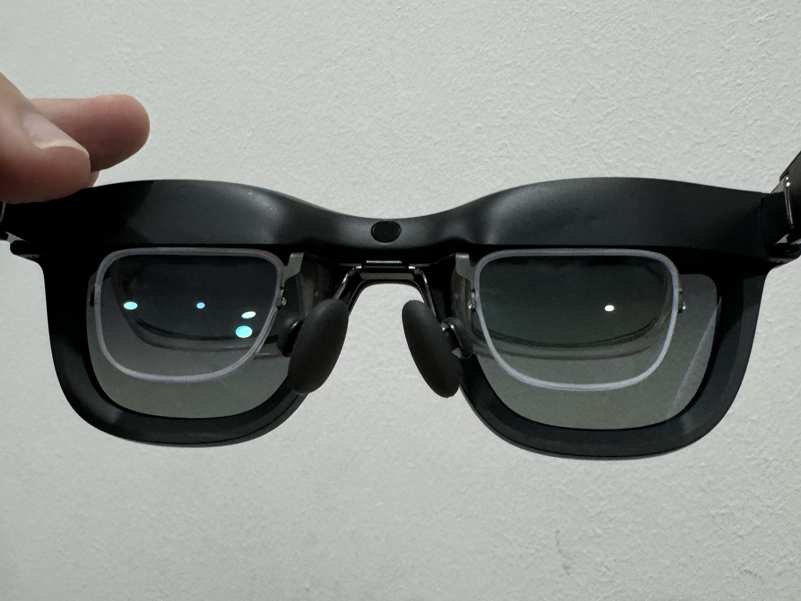
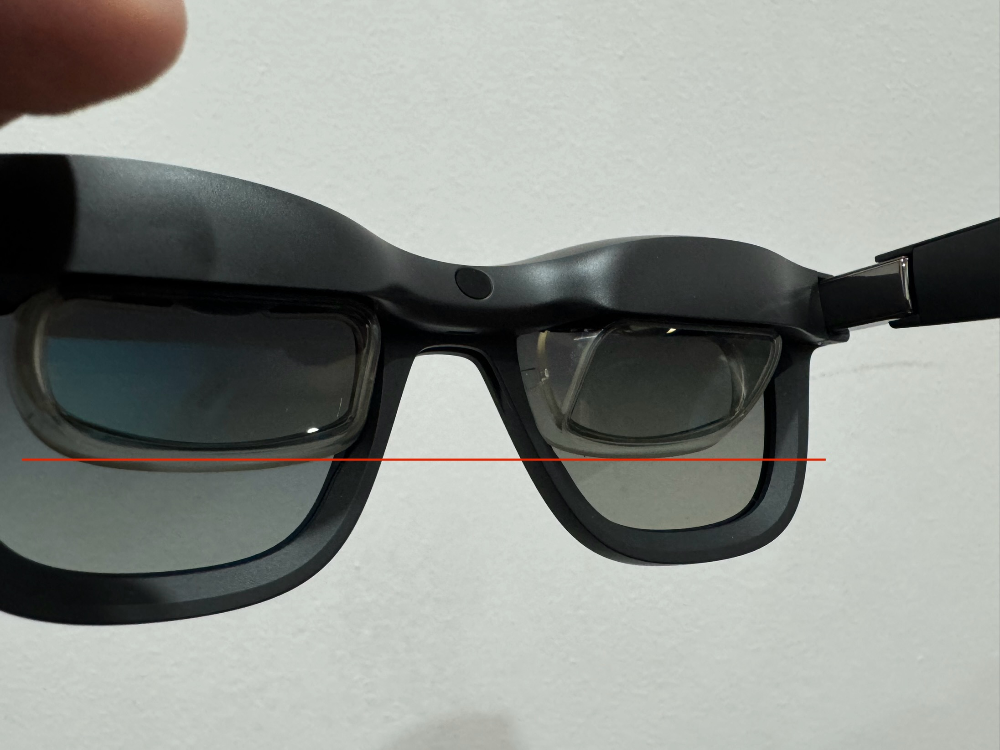
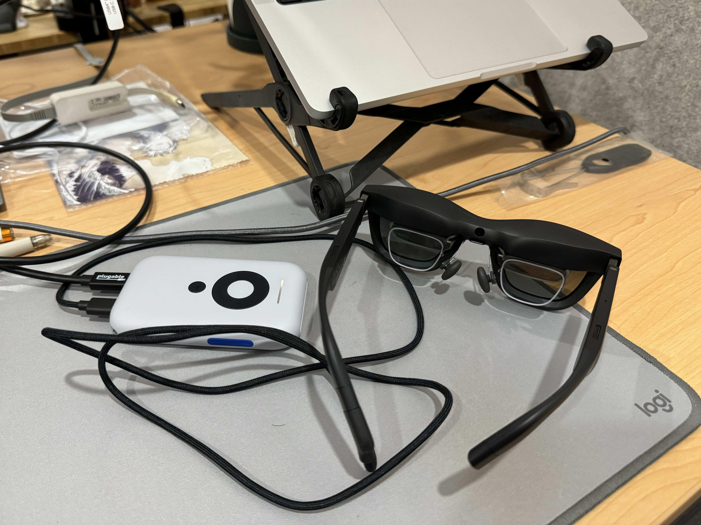

I'd been pondering adding a pair of AR glasses to my remote work setup, as an alternative to a portable monitor. Having seen good reviews and physically trying the XREAL Airs in Japan, I picked up a pair when they went on sale - just in time for a two week trip, where I'd be working remotely. The verdict after two weeks? I'll keep using them for my travel work setup, but I’m not giving up my 27-inch monitor at home.

## The setup
I got the XREAL Air 2 Pros. The key difference from the base model is that this comes with chromatic lenses, allowing you to change the tint with the press of a button, and allowing the lenses to get dark enough that you can skip using the lens cover.

In addition, I got:
- **the Beam device** - I’m not cleared to install the Nebula software on my work laptop. That would have allowed for screen anchoring, which the wisdom of Reddit said was important. So I got the Beam just for anchoring 😑.
- **prescription lenses from [HonsVR](https://honsvr.com/product/oculus-quest-2-prescription-lens-adapter/?gad_source=1&gclid=Cj0KCQjw28W2BhC7ARIsAPerrcLYM1RZBwfY9rxZkdQlTJuISora-S-vfdDIpMx0emgGkGgoRquoPhMaAhSvEALw_wcB)** (~US$76 with SPH prescription and a blue light filter). I'm not a fan of contact lens, so this was the only way for me to comfortably use the glasses.

## Using the XREALs unplugged

The glasses are noticeably larger than regular glasses or sunglasses. They also sit much further from your face, enough far that Face ID didn’t work for me. Despite the RayBan-esque styling, it’s pretty obvious they’re not typical sunglasses. That said, at 75g, they were lightweight - I never felt like they weighed on my nose too much.

One of the reasons I went for the Pro, instead of the base model, was the chromatic lenses. These would allow me to control the darkness of the glasses without needing the provided cover. In theory, I could then unplug and wear the glasses to go bathroom or grab a drink, instead of taking them off and wearing my glasses each time.

With prescription lenses, that use case kinda works, but one oddity is the displays cover half of the vertical area of the glasses, so you get this horizontal line across your field of view, with different tints on both sides. The glasses also remain in the “middle” tint setting while unplugged, so it's still like wearing sunglasses. In general, I still found myself taking off the XREALs and putting on my own glasses about 50% of the time. 
For the above reasons, they're not something I would wear outside.
## Using the XREALs without the Beam

When plugging the XREAL directly into a compatible USB-C device like a Macbook or iPhone 15, the glasses act as an external display, mirroring or extending your device’s screen. The image is sharp and text is very readable, but it can be quite hard to see the edges since they stay in your peripheral vision. The screen moves with your head, so if you want to focus on a corner you have to keep your head still and move just your eyes. As such, it’s great for watching video, but for doing work you’ll have to keep what you’re reading in the center of the screen.

I also learnt my head moves a lot when working, especially when typing. Because the screen follows your movements, it’s a bit disorienting, bordering on nauseating. Because of this, I rarely used the XREALs without the Beam, just the occasional video in bed or a long bus ride. Admittedly, the latter was cool, because with the chromatic lenses I could keep an eye out for when the scenery was nice and increase the transparency of the glasses accordingly. The caveat is that “horizontal line” still remains in the way.

## Using the XREALs with the Beam
The Beam allows you to mirror the display of your USB-C device and do screen without installing additional software. This sounds great and works, but there are tradeoffs 😞. 
Compared with directly plugging into a device, the image is noticeably blurrier, though still usable. There’s some sort of flickering, which is especially noticeable in dark backgrounds on lower brightness levels.

In most modes, you’re given the option to change the screen size. I mostly stuck with the default “120-inch”. In practice, this looked about the same size as my 27-inch monitor about 1m away from my head, which is actually pretty good. Larger screen sizes are possible, but there’s a limited field of view so your screens get cropped and you need to move your head to see the edges of your screen.

The resolution is 1080p “only”. I realised my home monitor (Dell) had been on 1080p for the last two years and I was quite happy with it, so this wasn’t a big problem for me. There are three display modes, but I only really used "Body Anchor" - "Smooth Follow" doesn’t let you see the edges well, and "Sideview" mode seems to be for watching something while doing something else, which doesn’t feel… safe?

It didn't seem like the Beam could mirror and charge at the same time. In practice, this wasn't too big a concern as the Beam lasts a good few hours on battery. As long as I remembered to charge it in between sessions, it was fine.

With anchoring, you can _mostly_ still use your Mac's display as a secondary display. If your wall / background is a flat colour, you can reduce the dimming on the lenses, so the physical display is still readable. All the caveats above still apply - there's the horizontal line, and the lens are still slightly tinted.

Sometimes, I’d encounter a subtle “drifting” of the screen when anchoring. Not too sure what was wrong, restarting the Beam didn’t seem to help. I’d have to occasionally re-anchor the screen till the problem went away.

## Other Notes
Because you don’t have to physically position an external monitor, the setup takes up a lot less space, and it’s more ergonomic since you can look forward at a floating screen, instead of hunching over a desk. My remote setup is currently:
- a 14-inch Macbook Pro
- a Roost laptop stand
- Logitech mouse
- random folding split keyboard
- It’s on the left below, in contrast to my wife’s setup: 

With the case and Beam, the setup was probably only a few hundred grams lighter than a portable monitor, but it’s significantly easier to pack and bring around. Plus you do technically get a larger display (most portable monitors are 16 inches).

I still took them the glasses off for video calls, though I think they could be a fun conversation starter.

I haven't tested Nebula much. Tried a little on my personal laptop, multiple screens seemed cool, but otherwise the quality of individual displays seemed to be a similar to the BEAM

## Summary

I couldn’t work a full day in them, but think I got enough benefit out of half a day that I could see myself continuing to use this setup when travelling.

**The good**
- Compact and easy to bring around
- A relatively big screen (though 120 inch is a bit misleading, in practice it was like using a 27-inch monitor on a desk)

**The meh** 
- Still can’t beat an actual desktop monitor in terms of field of view, comfort and clarity
- Beam is kinda annoying to manage
- Pricier than a portable monitor, especially if you need the Beam and prescription lenses

If you found this useful and are considering a purchasing the XREAL Air 2s, consider supporting my blog by using one of the following affiliate links:
- [Lazada Singapore](https://s.lazada.sg/s.1WjQN?cc)
- [Amazon US](https://amzn.to/3MlbT1c)

