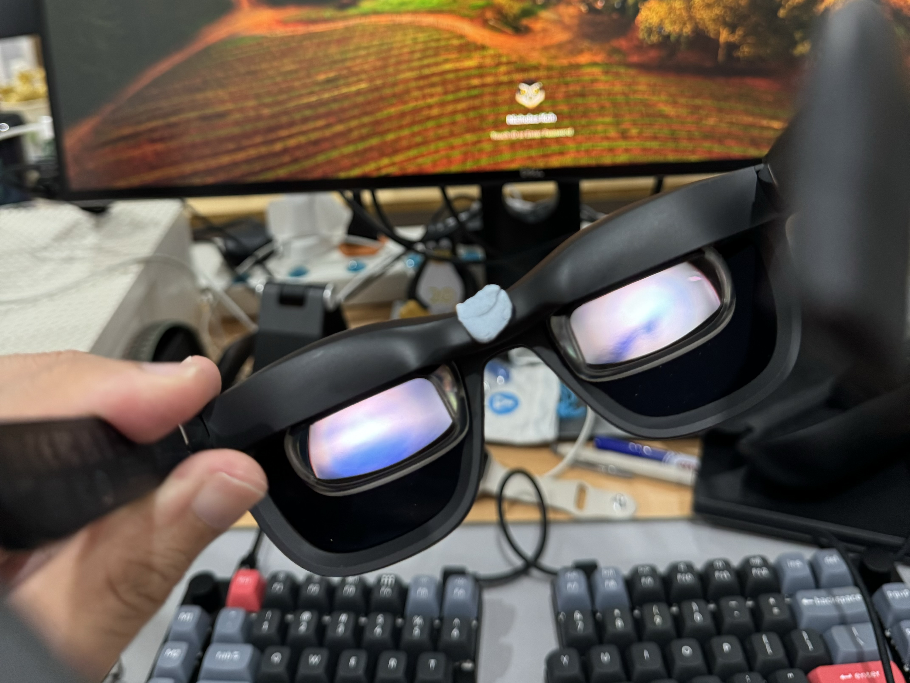

**I'd been pondering adding a pair of AR glasses to my remote work setup, as an alternative to a portable monitor.** After reading positive reviews and physically trying the XREAL Airs in Japan, I picked up a pair when they went on sale — just in time for a two-week trip where I'd be working remotely. The verdict after two weeks? I'll keep using them for my travel work setup, but I’m not giving up my 27-inch monitor at home.

## The Setup

I got the XREAL Air 2 Pros. The key difference from the base model is that this comes with electrochromic lenses, allowing you to change the tint with the press of a button. The lenses got dark enough that I could skip using the included lens cover.

In addition, I also purchased:

- **the Beam device** - I’m not cleared to install the Nebula software on my work laptop. That would have allowed for screen anchoring, which the wisdom of Reddit said was important. So I got the Beam just for anchoring 😑.
- **prescription lenses from [HonsVR](https://honsvr.com/product/oculus-quest-2-prescription-lens-adapter/?gad_source=1&gclid=Cj0KCQjw28W2BhC7ARIsAPerrcLYM1RZBwfY9rxZkdQlTJuISora-S-vfdDIpMx0emgGkGgoRquoPhMaAhSvEALw_wcB)** (~US$76 with SPH prescription and a blue light filter). I'm not a fan of contact lenses, so this was the only way for me to comfortably use the glasses.

## Using the XREALs unplugged

Don't be fooled by the marketing, these glasses will _not_ pass off as regular sunglasses in spite of the obvious RayBan influences. They are noticeably larger, and sit much further from your face. Face ID wouldn't work for me, while it does with my regular glasses.

That said, at 75g, they’re lightweight and comfortable for extended wear. The electrochromic lenses, a key feature of the Pro model, allow you to adjust the tint at the press of a button, eliminating the need for the lens cover. In theory, this lets you move around without having to swap back to your regular glasses.

However, the displays only cover half the vertical area, which creates an unavoidable horizontal line with different tints above and below. Plus, when unplugged, the glasses remain at a medium tint level, leaving you with sunglasses indoors—not ideal.

As a result, I ended up switching back to my regular glasses about half the time. While useful in specific scenarios, they’re not something I’d wear outside or as an everyday replacement for my usual glasses.

## Using the XREALs without the Beam

When plugged directly into a compatible USB-C device like a Macbook or iPhone 15, the glasses act as an external display, mirroring or extending your device’s screen. The image is sharp and text is very readable, but it can be quite hard to read the edges since those remain in your peripheral vision. The screen moves with your head, so if you want to focus on a corner you have to keep your head still and move just your eyes. As such, it’s great for watching video, but for doing work you’ll have to keep what you’re reading in the center of the screen.

I also learnt my head moves a lot when working, especially while I'm typing. Since the screen follows these movements, it’s a bit disorienting, bordering on nauseating. Due to this, I rarely used the XREALs without the Beam, save for the occasional video in bed or during a long bus ride. Admittedly, the latter was a cool use case; with the electrochromic lenses, I could adjust the transparency to appreciate the scenery. However, that persistent horizontal line remained a drawback.

## Using the XREALs with the Beam

The Beam allows you to mirror or extend your device's display without installing additional software, which sounds great and works, but there are tradeoffs 😞. 
Compared to a direct connection, the image is noticeably blurrier, though still usable. There's a subtle flickering, especially apparent on dark backgrounds at lower brightness levels.

In most modes, you can adjust the screen size. I primarily used the default "120-inch" setting, which, in practice, resembled a 27-inch monitor about a meter away—quite satisfactory. Larger screen sizes are possible, but due to the limited field of view, the screens get cropped, requiring you to move your head to see the edges.

The resolution is 1080p, which was acceptable for me, considering my home monitor had been set to 1080p for the past two years without issue. There are three display modes, but I mainly used "Body Anchor." "Smooth Follow" doesn't provide a clear view of the edges, and "Sideview" mode seems intended for multitasking, which didn't feel particularly safe or practical.

It appears the Beam can't mirror and charge simultaneously. In practice, this wasn't a significant concern, as the Beam's battery lasts several hours. As long as I remembered to charge it between sessions, it sufficed.

With screen anchoring, I was somewhat to use my Macbook's physical display as a secondary screen. Whe the wall was a flat colour, I could reduce the dimming on the lenses while keeping the XREAL display readable and allowing me to read the physical display. However, the aforementioned caveats (the horizontal line and tinting) meant I only used it for secondary functions e.g. keeping an eye on Slack or having Spotify open.

Occasionally, I noticed subtle drifting of the screen when anchored. Restarting the Beam didn't resolve this; I had to re-anchor the screen periodically until the issue subsided. Also, the Beam gets hot pretty quick, and the built-in fans will start whirling. It's not crazy loud but noticeable.

UPDATE 2025-02: my beam has started making a weird beeping sound, I'll have to ask XREAL what's going on here.

## Other Notes

Since you don't need to physically position an external monitor, the setup occupies much less space and is more ergonomic, allowing you to look forward at a floating screen instead of hunching over a desk.

My remote setup is currently:

- a 14-inch Macbook Pro
- a Roost laptop stand
- the Logitech POP mouse
- a folding split keyboard
- It’s on the left below, in contrast to my wife’s setup: 

With the case and Beam, the setup is only slightly lighter than a portable monitor but significantly easier to pack and transport. Plus, you technically get a larger display, as most portable monitors are around 16 inches.

I still removed the glasses for video calls, though they could serve as an interesting conversation starter.

I haven't extensively tested Nebula. I briefly tried it on my personal laptop; multiple screens seemed cool, but the quality of individual displays appeared similar to the Beam.

## Summary

I couldn’t work a full day in them, but think I got enough benefit out of half a day that I could see myself continuing to use this setup when travelling.

**The good**

- Compact and easy to bring around
- A relatively big screen (though 120 inch is a bit misleading, in practice it was like using a 27-inch monitor on a desk)

**The meh**

- Still can’t beat an actual desktop monitor in terms of field of view, comfort and clarity
- Beam is kinda annoying to manage
- Pricier than a portable monitor, especially if you need the Beam and prescription lenses

If you found this useful and are considering a purchasing the XREAL Air 2s, consider supporting my blog by using one of the following affiliate links:

- [Lazada Singapore](https://s.lazada.sg/s.1WjQN?cc)
