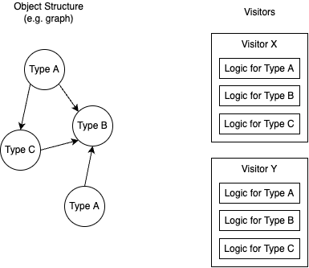
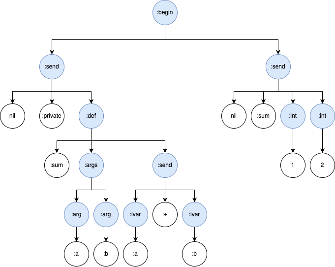
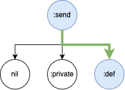
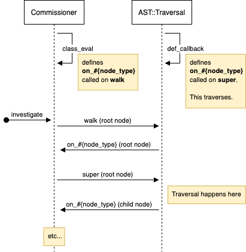

 In this post, we'll learn about the Visitor design pattern and it's tradeoffs by looking at a real world example: Rubocop, a Ruby linting and formatting library.
 

## What is the Visitor design pattern?
The visitor design pattern separates the operation to be performed from a complex object structure (e.g. a graph whose nodes have many types).



This makes it easy to introduce new operations ("visitors") for the same structure, but comes at a cost - changing the object structure requires all visitors to be changed. So this pattern works best when changes to the underlying structure are rare, and we expect many different operations to be introduced.

## What is Rubocop?
Rubocop is a linter[^1] and formatter, which is a fancy way of saying that it checks the raw source code against a set of rules (e.g. for common errors or conformance to a style guide) and can autocorrect it. Each rule in Rubocop is called a "cop" and follows a visitor-inspired pattern.
[^1]: See [Wikipedia](https://en.m.wikipedia.org/wiki/Lint_(software)).

Note that Rubocop doesn't follow the classical visitor implementation[^2] exactly, but separates concerns similarly. We'll look at how it tweaks the pattern, before describing the tradeoffs with real-life examples.

[^2]: See class diagram in Visitor chapter of [Design Patterns book](https://www.amazon.com/Design-Patterns-Object-Oriented-Addison-Wesley-Professional-ebook/dp/B000SEIBB8), or on [refactoring.guru](https://refactoring.guru/design-patterns/visitor#structure).

## Object Structure: Abstract Syntax Tree (AST)
Before running any cops, Rubocop first uses the [rubocop-ast](https://github.com/rubocop/rubocop-ast) library to create an Abstract Syntax Tree representing your Ruby code. This makes the responsibility of cops much simpler: they don't have to worry about syntax correctness, and because code is pre-grouped and categorised in the tree, it's easier to know when a linting rule should be triggered.

Let's look at a simple example:
```ruby
require 'rubocop-ast'

code_string = <<~CODE
  private def sum(a, b)
    a + b
  end

  sum(1, 2)
CODE
# => "private def sum(a, b)\n a + b\nend\n\nsum(1, 2)\n"

processed_source = RuboCop::AST::ProcessedSource.new(code_string, 3.1)
processed_source.ast
# =>
# s(:begin,
#   s(:send, nil, :private,
#     s(:def, :sum,
#       s(:args,
#         s(:arg, :a),
#         s(:arg, :b)),
#       s(:send,
#         s(:lvar, :a), :+,
#         s(:lvar, :b))),
#   s(:send, nil, :sum,
#     s(:int, 1),
#     s(:int, 2)))
```

The parsed AST breaks down the code into relevant constructs based on Ruby's syntax. We can visualize the above:



For now, it's sufficient to know that the object structure is basically a tree - don't worry too much if you don't understand exactly how it works. (For a good overview of how this AST fits into the Ruby interpretation process, check out this [great video](https://youtu.be/ySuMOEVLaMw) by [@OngMaple](https://twitter.com/OngMaple). You can also look [here](https://github.com/rubocop/rubocop-ast/blob/master/docs/modules/ROOT/pages/node_types.adoc) for a list of possible node types 🤯.)

## Visitor: Cops
Each linting or formatting rule in Rubocop is encapsulated in a "cop", which is essentially a visitor. For example, let's look at the [DefEndAlignment](https://github.com/rubocop/rubocop/blob/master/lib/rubocop/cop/layout/def_end_alignment.rb) cop. By default, this checks that `end` is aligned to `def` at the start of the line, e.g.:
```ruby
# bad
def foo
    end

# good
def foo
end
```

 Each cop defines `on_#{node_type}` methods, which the traversal mechanism will call when it hits a corresponding AST node. We can see the cop handles 3 node types, `on_def`, `on_defs` and `on_send`:
```ruby
def on_def(node)
  # ...
end
alias on_defs on_def

def on_send(node)
  # ...
end
```

(`on_send` might seem out-of-place - it's for handling "def modifiers" e.g. `private` in `private def foo`.)

If you recall the AST from before, there weren't any `end` nodes, and the structure itself left out indentations and spaces. So how does this linter work? Turns out that `parser` nodes still contain information about the source code (e.g. positions), and cops can use this in tandem with the original source code for linting.

Of note: this cop also does it's own little traversal for `on_send`. This is because the `send` node contains the start position of the `private` keyword, but the position of `end` is still in the  `def` node. Thus, the code accesses [descendants](https://github.com/rubocop/rubocop/blob/133ffce3d3179f6cf2d7750da2a2da0add8c7e41/lib/rubocop/cop/layout/def_end_alignment.rb#L51) to look for the actual `def` node. A visual from our previous example:



Also note that unlike the classical implementation, cops do not implement methods for all node types. Instead, there's logic that skips non-existent methods during traversal, which is a nice segue to our next section.

## Execution & Traversal
Object structure and visitors meet in the [Rubocop::Commissioner#investigate](https://github.com/rubocop/rubocop/blob/2fe4b1a6faca23adff13e1bbff6ecf5b66c6447b/lib/rubocop/cop/commissioner.rb#L79-L93) method. This method walks the tree and for each node, executes the respective `on_#{node_type}` method on all enabled cops.

The actual implementation is a little convoluted, with a fair amount of metaprogramming. It's a fun detour, but feel free to skip this! First, my attempt to visualise the flow with a sequence diagram:


- when the `Commissioner` class is loaded, it loops through node types, defining "original" `on_#{node_type}` methods via `class_eval` ([source](https://github.com/rubocop/rubocop/blob/2fe4b1a6faca23adff13e1bbff6ecf5b66c6447b/lib/rubocop/cop/commissioner.rb#L59-L76)).
- `#investigate` will execute [#walk](https://github.com/rubocop/rubocop-ast/blob/5b53037d322275cdd5082e4164f976146cc6c014/lib/rubocop/ast/traversal.rb#L17-L22) (from an included `Rubocop::AST::Traversal` module) on the root node of the AST, which calls the corresponding "original" `on_#{node_type}` methods defined above.
- the "original" `on_#{node_type}` methods will execute every relevant cop for the node.
- the "original" `on_#{node_type}` methods will also execute `super`, which calls an "inherited" `on_#{node_type}` method (again defined in `Rubocop::AST::Traversal` via metaprogramming, see an example for [on_send](https://github.com/rubocop/rubocop-ast/blob/5b53037d322275cdd5082e4164f976146cc6c014/lib/rubocop/ast/traversal.rb#L154-L160)).
- the "inherited" method loops through child nodes, again invoking the original `on_#{node_type}` methods in Commissioner, this time with the child nodes.

I haven't dug up the *why* behind this particular design, my guess so far is (1) metaprogramming makes it easier to support new node types, and (2) this was a way to separate the traversal logic from the cop execution logic.

Note that the classical visitor implementation doesn't dictate where traversal logic should go. In Rubocop, the main traversal is separate from both object structure and visitors, but in other situations it might work better to put the logic in the object structure (or some parts of it, e.g. composite elements might encapsulate their traversal) or in the visitor itself (e.g. if different visitors need to traverse in a different order)[^3].

[^3]: See "Who is responsible for traversing the object structure?" in Visitor chapter,  [Design Patterns book](https://www.amazon.com/Design-Patterns-Object-Oriented-Addison-Wesley-Professional-ebook/dp/B000SEIBB8)

## Tradeoffs
Now that we know how Rubocop implements a visitor-inspired pattern, let's briefly examine the benefits and cost of the design.

### Benefit: Encapsulation of each Linting Rule in a Visitor
Each cop encapsulates the linting and formatting logic for a single rule, making it simple to disable or restrict the scope of that cop, without affecting other cops. In Rubocop, you can disable cops via a [small config change](https://docs.rubocop.org/rubocop/1.34/configuration.html#enabled). The traversal logic will then ignore those cops.

### Benefit: Ease of extension by adding new Visitors
The object structure and traversal logic is separate from the visitor logic - this makes it easy for a user of the gem (us!) to add and enable new [custom cops](https://docs.rubocop.org/rubocop/1.33/development.html), without needing to touch the object structure or traversal code.

### Cost: Coupling to Object Structure
Changes to the underlying object structure may ripple through all visitors. For example:
- If node categorisation changes, cops may no longer be checking correctly for those types e.g. in Ruby 3, how pattern matching was parsed [changed slightly](https://github.com/rubocop/rubocop/pull/9873).
- If the hierarchy changes and ordering of nodes change, it could break traversal. We saw this coupling earlier in `DefEndAlignment#on_send`, which expects that `def` nodes are children of `send`. If that changes, the cop wouldn't work properly. Arguably, this is rare in Ruby's case, and can also be mitigated through more abstract traversal (e.g. [node pattern](https://docs.rubocop.org/rubocop-ast/node_pattern.html), which reminds me a lot of CSS selectors).

### Cost: Reduced encapsulation of Object Structure
Depending on the needs of visitors, objects in the structure may need to expose more information, potentially breaking encapsulation. In our example, Rubocop cops need to know about positions in the actual source code through methods like `#loc`, which is less useful for a program emulating the Ruby interpreter - it only needs to execute the logic represented by the node types.

## Afterword
I hope this helped concretise when and why you might want to use the visitor pattern. Here are some other examples you may want to look into:
- `nokogiri`, a XML/HTML parsing library, has a [CSS::XPathVisitor](https://github.com/sparklemotion/nokogiri/blob/148bdf5edc1f9963274b57ae899b4f651b53315b/lib/nokogiri/css/xpath_visitor.rb).
- `syntax-tree`, another Ruby parser, has [visitor support](https://github.com/ruby-syntax-tree/syntax_tree/blob/main/lib/syntax_tree/visitor.rb) (see [PR](https://github.com/ruby-syntax-tree/syntax_tree/pull/40/files))
- `graphql-ruby`, a GraphQL parser, also has an [AST Visitor](https://graphql-ruby.org/language_tools/visitor.html)

I was invited to share about this at RubySG, here's a video with some cold jokes:
`youtube: [Talk: How Rubocop uses the Visitor Pattern](https://www.youtube.com/watch?v=psOz2Lgp6KU)`

