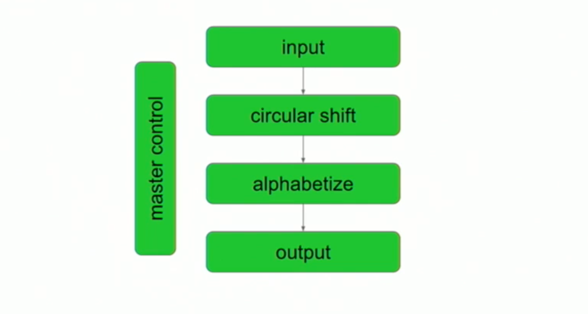
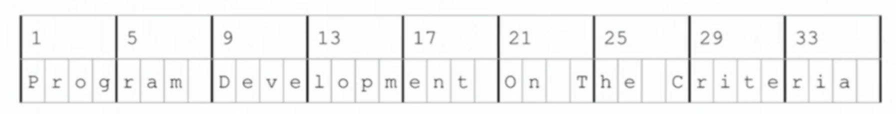
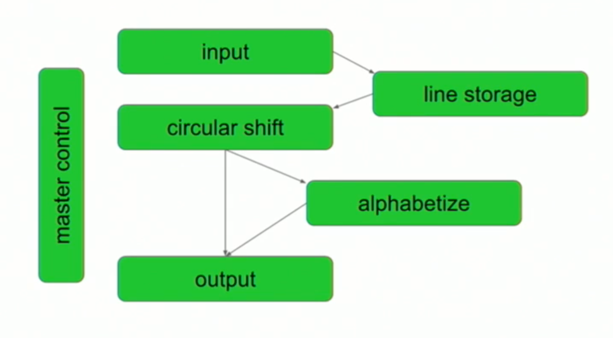

"*A class should only have one reason to change*" is a mantra that Object-Oriented advocates have chanted for years. Dubbed the "Single Responsibility Principle" (SRP), it remains somewhat abstract till this day ✨. Abstract enough, in fact, that it's originator (Robert Martin) felt it worthwhile to explain again in a [blog post](https://blog.cleancoder.com/uncle-bob/2014/05/08/SingleReponsibilityPrinciple.html) - 14 years after he first wrote about it!

That blog post begins by referencing and quoting a 1972 paper, "**On the Criteria To Be Used in Decomposing Systems into Modules**" by David Parnas:

> “We have tried to demonstrate by these examples that it is almost always incorrect to begin the decomposition of a system into modules on the basis of a flowchart. 
> 
> We propose instead that one begins with a list of difficult design decisions or design decisions _which are likely to change_. Each module is then designed to hide such a decision from the others.”

The paper seemed significant, as Martin wrote that the SRP appeared "to align with Parnas’ formulation". Could it demystify the SRP? What exactly was this paper about?

## The System: KWAC Index
First, Parnas sets the stage - he would compare two approaches ("criteria") for modularizing a system, showing that one provided superior flexibility. That system was a KWAC (KeyWord Alongside Context) index.

KWAC was one of many indexing systems used for technical manuals. Important words in sentences were emphasised by "rotating" or "circularly shifting" the word such that it was the first. For example, given the title "**Office 2003 Timesaving Techniques for Dummies.**" and the keyword "**Dummies**", we'd get "**Dummies. Office 2003 Timesaving Techniques for**", as below:


The next sections explain Parnas' modularizations. This [video explanation](https://youtu.be/R7X4B3-k7g4?t=1036) (starting from 17:16) helped me visualise and understand them, and I'll borrow liberally from it 🙇‍♂️.

## Modularization 1: "Flowchart"
In the first modularization, Parnas modelled the problem as a flowchart, using the individual steps to break apart the modules (an approach which I'm guilty of applying at face value):

There's a design flaw that isn't obvious in the diagram - all the modules rely upon common data stored in memory using pretty low-level operations. The implications will become clearer later on.

Here's what each module did:

- **Input** 
  - Given an example input file like:  
  ```shell
  # cat input.txt
  Program Development # line 1
  On The Criteria # line 2
  ```
  - Parses the input text file (each line is a book title) and stores in memory using low-level operations. 
  - There's a section of the [video (23:36)](https://youtu.be/R7X4B3-k7g4?t=1415) that explains this, which if I've understood right goes something like: **(1.)** memory at the time was accessed in groups of 4 characters (bytes), **(2.)** the input was split across these groups, with spaces in between words, **(3.)** the split between lines would be stored separately.
  - We can visualise the parsed and stored example file as something like:
     
  - We'll call the above data "Characters"
  - The module also outputs "Lines", which is an array stating the start of each line (e.g. 1, 21 above)
- **Circular Shifter**
  - Accessing "Characters" and "Lines", it outputs an array of "Shifts".
  - Each "Shift" stored the line number, as well as the starting index of each word.
- **Alphabetizer**
  - Accessing "Characters" and "Shifts", it sorts the "Shifts" alphabetically and outputs them as "Alphabetized".
- **Output**
  - Accessing "Characters" and "Alphabetized" shifts, outputs the KWAC index, something like:
  ```shell
  # Using the golang example from the video, link in Further Reading
  # go run m1/main.go input.txt
  Criteria | On The [2]
  Development | Program [1]
  On The Criteria [2]
  Program Development [1]
  The Criteria | On [2]
  ```

A helpful visual summary of all the outputs and stored data: 


## Modularization 2: "Information Hiding"
In this modularization, Parnas uses the criteria of "Information Hiding". The definition is worth mentioning for it's relevance to the SRP:

> Every module in the second decomposition is characterized by its knowledge of a design decision which it hides from all others. Its interface or definition was chosen to reveal as little as possible about its inner workings.

Practically speaking, there were three major differences that I noticed in this modularization:
- The details of how the characters were stored was encapsulated (hidden) via a new module, "Line Storage". This meant that other modules did not have to know the low-level layout of the data. Instead, they would have a simpler interface to store and retrieve characters.
- The dependencies of modules are also tweaked, such that only two modules interact directly with "Line Storage", as opposed to every module having to access "Characters" in Modularization 1.
- Modules in Modularization 1 depended on outputs or common data from previous modules. In contrast, modules in Modularization 2 depended directly on the interface of other modules (similar to calling methods on the module, a more Object-Oriented style).


Each module in greater detail:
- **Input**
  - Like Modularization 1, also parses the input file, but this time initializes a "Line Storage" and inserts the data.
- **Line Storage**
  - Think of it like an Object that has methods for inserting and retrieving characters by line (e.g. get Character 5 of Line 1, Word 2).
  - Note: Unlike Modularization 1, this means callers do not need to know the nitty-gritty details of how data is stored.
- **Circular Shifter**
  - Generates the circular shifts from Line Storage in an initialization step.
  - Instead of outputting "Shifts", the module itself provides an interface (like an Object) similar to Line Storage, but allows retrieval of characters by their *shifts* instead of lines (e.g. get Character 5 of *Shift* 1, Word 2).
- **Alphabetizer**
  - Retrieving the characters from Circular Shifter, this modules sorts by alphabet and remembers the shifts in an initialization step.
  - Instead of outputting the "Alphabetized" shifts, the module also provides an interface for getting ordered Circular Shifts indexes (e.g. tell me the shift number that's in the 2nd sorted position).
- **Output**
  - Uses Alphabetizer and Circular Shifter to generate the KWAC Index.

## Comparison: Changeability
While other comparisons were made, the analysis of changeability speaks most to the SRP. Parnas begins by suggesting some "likely" change scenarios. Most require many modules to be updated in Modularization 1, but have a much smaller blast radius in Modularization 2:

|Scenario|Modularization 1|Modularization 2|
|-|-|-|
|A. Deciding to store "Characters" in a different medium (e.g. filesystem) instead of memory|All modules|Line Storage|
|B. Deciding on a different way to store the "Characters" (e.g. group by words instead of every 4 characters) | All Modules | Line Storage|
|C. Deciding to store the full sentences of each circular shift instead of their indexes |Circular Shifter, Alphabetizer, Output |Circular Shifter|
|D. Deciding to change "Alphabetized" generation to be lazy or distributed (possibly due to a large dataset?)|Difficult to achieve as computation must be completed before output|Achievable as Output doesn't need all the shifts to be "alphabetized"|

Let's take Scenario B as an example - since all the modules in Modularization 1 depended upon a specific layout of "Characters" in memory, changing that layout would require changing every module. However, in Modularization 2, this would only require a change in the implementation of "Line Storage" - the interface could stay the same, meaning other modules were shielded from this change!

So the takeaway here is that good "information hiding" (a.k.a the SRP) results in a system that is easier to change. 

## Conclusion
So where does the paper leave us in relation to the SRP? Personally, I left with a better understanding of *why* it was important - it should result in code that is easier to change. However, even with the (helpful) example, we don't get a magic formula for applying the SRP - it remains more art than science.

What's your framework for beginning "with a list of difficult design decisions or design decisions which are likely to change"?

Discuss on [Hackernews](https://news.ycombinator.com/item?id=30529854).

(I apologise for the mix of American and British english 😆.)

## Further Reading:
- Diego Ontaro's [talk](https://youtu.be/R7X4B3-k7g4?t=1036) and his example [code](https://github.com/ongardie/kwic) in Go.
- [KWIC Indexes in Wikipedia](https://en.wikipedia.org/wiki/Key_Word_in_Context) - note that the original paper calls it a KWIC index, but as Diego Ontaro explains, it's actually a KWAC index.
- Parnas' Original Papers: [1972](https://www.win.tue.nl/~wstomv/edu/2ip30/references/criteria_for_modularization.pdf) (which references an earlier paper written in [1971](https://prl.ccs.neu.edu/img/p-tr-1971.pdf) with more implementation details).
- Adrian Colyer's elegant and higher-level [summary](https://blog.acolyer.org/2016/09/05/on-the-criteria-to-be-used-in-decomposing-systems-into-modules/) of the same paper.
- The paper does make a few other comparisons and points, I've left them out to keep this more focused to the SRP. A summary of what's missing can be found in this [gist](https://gist.github.com/wasabigeek/08a09190a90ac4463660debce778ef31).
