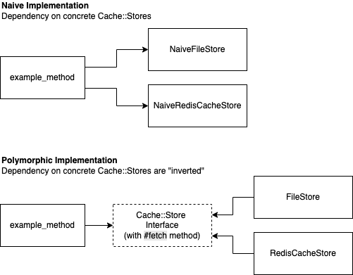

When I first came across the concept of Polymorphism in Object-Oriented Programming (OOP), it wasn't obvious to me _why_ it was important. The top search results generally explain _what_ it is and _how_ to use it, but handwave the _why_ and treat it as yet-another-language-feature. 

A [blog post](https://blog.cleancoder.com/uncle-bob/2018/04/13/FPvsOO.html) by Robert Martin (who coined the SOLID acronym) caught my eye recently, in particular this statement:

> ...the thing that truly differentiates OO programs from non-OO programs is polymorphism.

Whoa! Now he doesn't mean that encapsulation and other "OOP" concepts aren't important - the argument is that they are achievable in "non-OOP" as well, but not polymorphism. If polymorphism is a defining aspect of OOP, shouldn't we build a stronger intuition for _why_ it's important?

## What is polymorphism?
Let's set the stage by aligning on what Polymorphism in OOP is. In the same post, Martin explains Polymorphism as different kinds of objects being able to accept the same message, implementing their own behaviour. I'll paraphase his example:
```
some_object.do_the_right_thing(input)
```
We don't actually know what `some_object` is! Many different implementations could replace `some_object`, and the program would still run as long as they had the same interface (i.e. have the method `#do_the_right_thing`).

## Why polymorphism?
In another [blog post](https://blog.cleancoder.com/uncle-bob/2014/11/24/FPvsOO.html), Martin says:

> There really is only one benefit to Polymorphism; but it’s a big one. It is the inversion of source code and run time dependencies.

Let's concretise this with an example: caching in a web framework like Rails. There are multiple options out there for caches - for example, Rails supports a `FileStore`, a `MemCacheStore` and a `RedisCacheStore`. For the sake of illustration, imagine that the caches all had their own interfaces:
```ruby
def example_method
  # do stuff
  if Rails.cache.is_a? NaiveFileStore
    data = Rails.cache.search_for(key)
  elsif Rails.cache.is_a? NaiveRedisCacheStore
    data = Rails.cache.get(key)
  end
  # do more stuff
end
```

Above, our `example_method` has a direct dependency on `NaiveFileStore` and `NaiveRedisCacheStore`. If their interfaces change, or new kinds of stores are supported, it will require changes in `example_method`.

Martin talks about an inversion of dependencies (D in SOLID) - practically this means  `example_method` and the different cache stores instead depend on an agreed interface. This makes all cache stores polymorphic! In Rails all [cache stores](https://guides.rubyonrails.org/caching_with_rails.html#activesupport-cache-store) implement a `#fetch` method, so the above becomes:

```ruby
def example_method
  # do stuff
  data = Rails.cache.fetch(key)
  # do more stuff
end
```

The code in `example_method` is more concise now, but that's a side benefit; what's important is it's shielded from knowledge of which exact cache store is used, and how the store works. It just knows that _some_ cache store exists (`Rails.cache`), and the cache store has agreed to implement `#fetch` method.

We can visualise the  change in "dependency directions" (the arrows) below:


Martin describes this as a "plugin architecture":

> This inversion allows the called module to act like a plugin. Indeed, this is how all plugins work...
> Plugin architectures are very robust because stable high value business rules can be kept from depending upon volatile low value modules such as user interfaces and databases.

With the new setup, the polymorphic cache stores can be swapped for each other without changing the code in `example_method`. New kinds of cache stores can also be supported by creating classes that implement  `#fetch` and other methods as specified by [ActiveSupport::Cache::Store](https://guides.rubyonrails.org/caching_with_rails.html#activesupport-cache-store). 

In short, polymorphism makes it easier to extend or change aspects of our programs, without a rippling of changes throughout the entire program. (On determining these 
"aspects", a good read would be [Parnas' classic 1972 paper](https://www.wasabigeek.com/blog/what-does-a-1972-paper-have-to-do-with-the-single-responsibility-principle/).)

## Afterword
Note that polymorphism means other things outside the context of OOP (see [Wikipedia](https://en.m.wikipedia.org/wiki/Polymorphism_(computer_science))). The definition we used aligns quite closely to "duck-typing".

There are many other neat examples relating to polymorphism. Here's some I thought of:
- Martin Fowler's [refactoring](https://martinfowler.com/books/refactoring.html) book has a "Replace Conditional with Polymorphism" refactoring, which I think was neatly illustrated in this [Sandi Metz talk](https://youtu.be/8bZh5LMaSmE).
- Many [Behavioural Design Patterns](https://refactoring.guru/design-patterns/behavioral-patterns) rely on polymorphism, for example the Strategy, Command, Visitor etc.
- The [NullObject](https://refactoring.guru/introduce-null-object) is a neat way to support no-ops when your code relies on a Polymorphic interface.

For more musings on software design (with a Ruby/Rails slant), follow me on Twitter:
<blockquote class="twitter-tweet"><p lang="en" dir="ltr">“…the thing that truly differentiates OO programs from non-OO programs is polymorphism.”<br>- <a href="https://twitter.com/unclebobmartin?ref_src=twsrc%5Etfw">@unclebobmartin</a><a href="https://t.co/PTmFdySst7">https://t.co/PTmFdySst7</a></p>&mdash; Nick (@wasabigeek) <a href="https://twitter.com/wasabigeek/status/1505554975404949505?ref_src=twsrc%5Etfw">March 20, 2022</a></blockquote>


