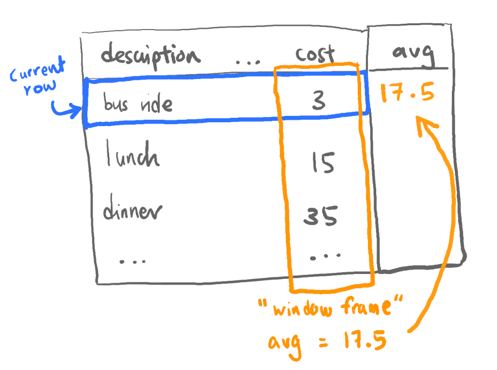
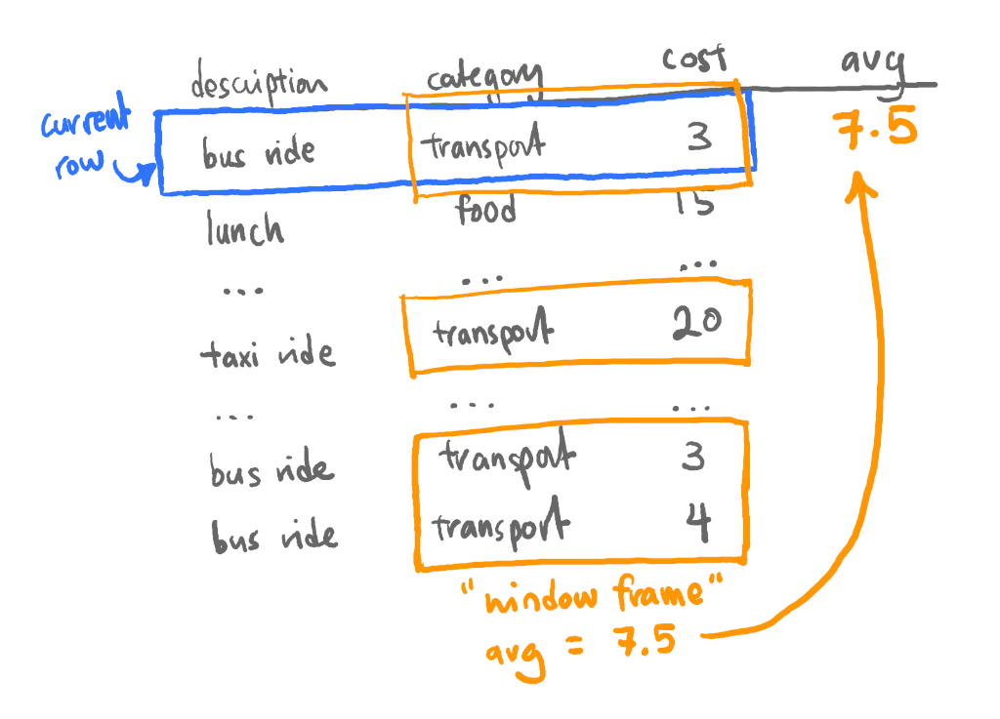
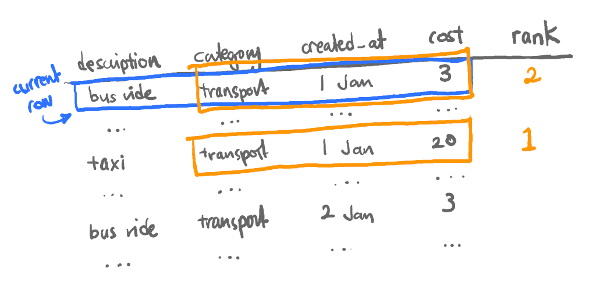

What is a **window function call**? My explanation:

> adds a column to query results that is calculated based on other rows in the table

Ok, that's probably still not immediately understandable, so let's walk through an example. Imagine you've been tracking expenses in Postgres:

| description | category      | created_at | cost |
| ----------- | ------------- | ---------- | ---- |
| bus ride    | transport     | 2020-01-01 | 3    |
| lunch       | food & drinks | 2020-01-01 | 15   |
| ...         |               |            |      |

Now, say you wanted to see how much each expense compares to the average:

| description | category | created_at | cost | avg  |
| ----------- | -------- | ---------- | ---- | ---- |
| bus ride    | ...      | ...        | 3    | 17.5 |
| lunch       | ...      | ...        | 15   | 17.5 |
| ...         |          |            |      |      |


You *could* use a subquery to calculate the average:

```sql
select *, (select avg(cost) from expenses)
from expenses;
```

But we could also be a little fancier and use a window function call:

```sql
select *, avg(cost) over()
from expenses;
```

Although we have some new syntax to understand (which we'll get into later), that's noticeably shorter! What just happened?

## Hello, Window Frames

Let's try to visualise the window function call. For each row, Postgres calculates the average cost of the rest of the table, which is the default **"window frame"**:



Now if that was all you could do with window function calls, I'd be disappointed too. Thankfully, it's not! Aside from being shorter, there are some key features that are harder to replicate with subqueries:

- calculations can be done over a subset of the table (i.e. a smaller **window frame**) instead of the whole table
- in addition to the usual aggregation functions like `avg` or `max`, there are **window functions**, which can only be used as part of a window function call

## Reframing the Window

Let's try calculating over a subset. Knowing the average across all expenses wasn't very helpful - a big purchase could skew the calculation, so let's instead compare each expense to the _category average_:

```sql
select *, avg(cost) over(partition by category) as "avg in category"
from expenses;
```

Our result now looks something like:

| description   | category      | created_at | cost | avg in category |
| ------------- | ------------- | ---------- | ---- | --------------- |
| tea break     | food & drinks | ...        | 5    | 24              |
| lunch         | food & drinks | ...        | 15   | 24              |
| ...           |               |            |      |                 |
| taxi to home  | transport     | ...        | 20   | 7.5             |
| bus ride home | transport     | ...        | 3    | 7.5             |
| ...           |               |            |      |                 |


That's a bit more helpful! Let's visualise this:



For each row, our new window frame includes only other rows with the same category, and the average is calculated based on those rows.

This is also a good time to take a brief look at the syntax we've used so far:

```sql
..., avg(cost) OVER(PARTITION BY category), ...
```

In the above:
- `avg(cost)` is the aggregation function that we want to execute over the window frame - we could use other functions such as `max` or `min`
- `OVER` is the keyword which tells Postgres we were using a window function call. Everything in parentheses specifies how our table will be divided into different window frames
- in this case, we are using `PARTITION BY category`, which means we are dividing the table into different window frames based on their category


## Window Functions

Now that we know a little more about the syntax, let's look at the other hidden power of window functions calls... **window functions** themselves!

It's coming to the end of the month, and you want to know the biggest expense in each category, for each day. There's a window function for that - `rank`!

With `rank`, we can calculate the order of each row in it's window frame (Note that the following query still returns every row in the table, not just the top expenses - we'll fix that later):

```sql
select
  *,
  rank() over(
    partition by category, created_at
    order by cost desc
  )
from expenses;
```

Notice the additional syntax in our window function call:

```sql
... OVER(PARTITION BY category, created_at ORDER BY cost DESC) ...
```

- we've added a second condition to `PARTITION BY` to further divide each window frame by the day each entry was `created_at` (this is very similar to `GROUP BY`)
- there's now an `ORDER BY ... DESC` that orders the rows within each frame from highest to lowest cost, so we'll know that a rank of 1 would be the most expensive

Another quick visual:



So for each row, our window frame is other rows with the same category and created_at date, and we order the rows from highest to lowest cost.

The query gives us a result like:

| description | category      | created_at | cost | rank |
| ----------- | ------------- | ---------- | ---- | ---- |
| groceries   | food & drinks | 2020-01-01 | 60   | 1    |
| dinner      | food & drinks | 2020-01-01 | 35   | 2    |
| lunch       | food & drinks | 2020-01-01 | 15   | 3    |
| ...         |               |            |      |      |
| taxi        | transport     | 2020-01-01 | 20   | 1    |
| bus ride    | transport     | 2020-01-01 | 3    | 2    |
| bus ride    | transport     | 2020-01-02 | 4    | 1    |
| ...         |               |            |      |      |


Now that we have a ranking, we could use it as a subquery and filter out expenses that are rank 2 or higher.

```sql
select *
from (
  -- our earlier query
  ...
) as "ranked_expenses"
where rank = 1;
```

Which leaves us with exactly what we want - nice!

| description   | category      | created_at | cost | rank |
| ------------- | ------------- | ---------- | ---- | ---- |
| groceries     | food & drinks | 2020-01-01 | 60   | 1    |
| lunch         | food & drinks | 2020-01-02 | 15   | 1    |
| taxi to home  | transport     | 2020-01-01 | 20   | 1    |
| bus ride home | transport     | 2020-01-02 | 4    | 1    |
| ...           |               |            |      |      |


I hoped that helped you grok window functions! If you want to play around with the data in this example, there's an [sqlfiddle](http://sqlfiddle.com/#!17/f33e78/3) - in case that doesn't exist at the time of reading, you can also get the SQL to create the table and query the data from this [gist](https://gist.github.com/wasabigeek/2b9fb05eba5c26928bab85bcf408511f).

In the next few articles, we'll look into the individual window functions, starting with those for [ranking rows](/blog/window-function-visualized-rankings/).
