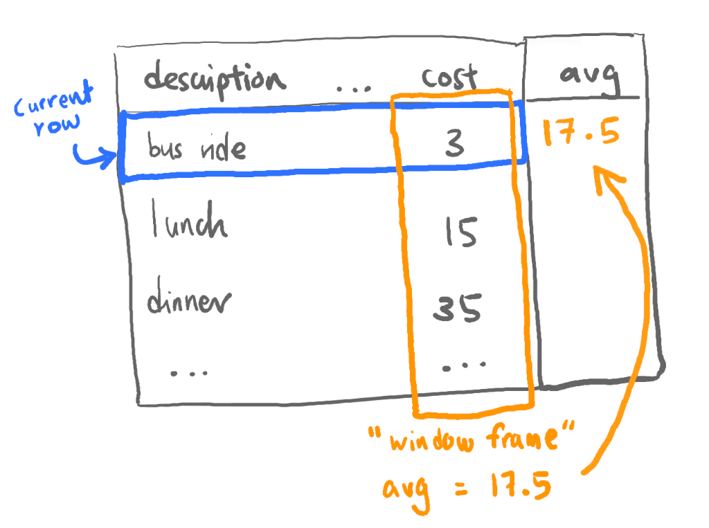

What is a **window function call**? My explanation:

> adds a column to query results that is calculated based on other rows in the table

It's easiest to show by example. Let's say we've been tracking our expenses in Postgres, because we can:

| id |      description |      category | created_at | cost |
|----|------------------|---------------|------------|------|
|  1 | bus ride to work |     transport | 2020-01-01 |    3 |
|  2 |            lunch | food & drinks | 2020-01-01 |   15 |
| ... |

Now say we wanted to be able to see how much more expensive each expense was compared to the average, something like this:

| id |      description |      category | created_at | cost |  avg |
|----|------------------|---------------|------------|------|------|
|  1 | bus ride to work |     transport | 2020-01-01 |    3 | 17.5 |
|  2 |            lunch | food & drinks | 2020-01-01 |   15 | 17.5 |
| ... |


You *could* use a subquery to calculate the average:

```sql
select *, (select avg(cost) from expenses)
from expenses;
```

But we could also be a little fancier and use a window function call:

```sql
select *, avg(cost) over()
from expenses;
```

Although we have some new syntax to understand (which we'll get into later), that's noticeably shorter! What just happened?

Let's try to visualise. For each row, Postgres calculates the average cost of the rest of the table, which is the default **window frame**:



Now if that was all you could do with window function calls, I'd be disappointed too. Thankfully, it's not! Aside from being shorter, there are some key features that are harder to replicate with subqueries:

- calculations can be done over a subset of the table (i.e. a smaller **window frame**) instead of the whole table
- in addition to the usual aggregates functions like `avg` or `max`, there are some additional functions only available in window functions

## Reframing the Window

Let's try calculating over a subset. Knowing the average across all expenses isn't very helpful - a big purchase could skew the calculation, so let's instead compare each expense to the average in it's category. Here's a window function call we could write:

```sql
select *, avg(cost) over(partition by category) as "avg in category"
from expenses;
```

And this is the result we'll get:

| id  | description   | category      | created_at | cost | avg in category |
| --- | ------------- | ------------- | ---------- | ---- | --------------- |
| 9   | tea break     | food & drinks | 2020-01-02 | 5    | 24              |
| 2   | lunch         | food & drinks | 2020-01-01 | 15   | 24              |
| ... |               |               |            |      |                 |
| 4   | taxi to home  | transport     | 2020-01-01 | 20   | 9               |
| 7   | bus ride home | transport     | 2020-01-02 | 3    | 9               |
| ... |               |               |            |      |                 |


Now the averages are calculated per category - cool! Let's visualise that again:

<picture>

This is also a good time to take a brief look at the syntax we've used so far:

<picture>

```sql
..., avg(cost) OVER(PARTITION BY category), ...
```

In the above:
- `avg(cost)` is the aggregation function that we want to execute over the window frame - we could use other functions such as `max` or `min`
- `OVER` is the keyword which tells Postgres we're going to start writing a window function call. Everything in the parentheses after `OVER` specifies how our table will be divided into different window frames
- in this case, we are using `PARTITION BY category`, which means we are dividing the table into different window frames based on their category


## Window Functions

Now that we know a little more about the syntax, let's look at the other hidden power of window functions calls... **window functions** themselves!

It's coming to the end of the month, and I want to know the most expensive thing I've bought in each category, each day. There's a window function for that - `rank`!

With `rank`, we can calculate the order of each row in it's window frame. We'll still be returning every row in the table, not just the top expenses, but it will make it easier to figure out the top ones:

```sql
select
  *,
  rank() over(
    partition by category, created_at
    order by cost desc
  )
from expenses;
```

Notice the additional syntax in our window function call:

```sql
... OVER(PARTITION BY category, created_at ORDER BY cost DESC) ...
```

- we've added a second condition to `PARTITION BY` to further divide each window frame by the day each entry was created_at
- there's now an `ORDER BY ... DESC` that orders the rows within each frame from highest to lowest cost, so we'll know that a rank of 1 would be the most expensive row

A quick visual of how that looks:

<picture>

The query gives us a result like:

| id |      description |      category | created_at | cost | rank |
|----|------------------|---------------|------------|------|------|
|  4 |        groceries | food & drinks | 2020-01-01 |   60 |    1 |
|  3 |           dinner | food & drinks | 2020-01-01 |   35 |    2 |
|  2 |            lunch | food & drinks | 2020-01-01 |   15 |    3 |
|  6 |           supper | food & drinks | 2020-01-01 |   15 |    3 |
|  8 |            lunch | food & drinks | 2020-01-02 |   15 |    1 |
|  9 |        tea break | food & drinks | 2020-01-02 |    5 |    2 |
|  5 |     taxi to home |     transport | 2020-01-01 |   20 |    1 |
|  1 | bus ride to work |     transport | 2020-01-01 |    3 |    2 |
| 10 |    bus ride home |     transport | 2020-01-02 |    4 |    1 |
|  7 | bus ride to work |     transport | 2020-01-02 |    3 |    2 |


Now that we have a ranking, we could use it as a subquery and filter out expenses that are rank 2 or higher.

```sql
select *
from (
  -- our earlier query
  ...
) as "ranked_expenses"
where rank = 1;
```

Which leaves us with exactly what we want - nice!

| id |   description |      category | created_at | cost | rank |
|----|---------------|---------------|------------|------|------|
|  4 |     groceries | food & drinks | 2020-01-01 |   60 |    1 |
|  8 |         lunch | food & drinks | 2020-01-02 |   15 |    1 |
|  5 |  taxi to home |     transport | 2020-01-01 |   20 |    1 |
| 10 | bus ride home |     transport | 2020-01-02 |    4 |    1 |


I hoped that helped you grok window functions! If you want to play around with the data in this example, there's an [sqlfiddle](http://sqlfiddle.com/#!17/f33e78/3) - in case that doesn't exist at the time of reading, you can also get the SQL to create the table and query the data from this [gist](https://gist.github.com/wasabigeek/2b9fb05eba5c26928bab85bcf408511f).

To dig deeper, check out the Postgres docs, starting from the [tutorial](https://www.postgresql.org/docs/current/tutorial-window.html), especially the list of [window functions](https://www.postgresql.org/docs/current/functions-window.html).