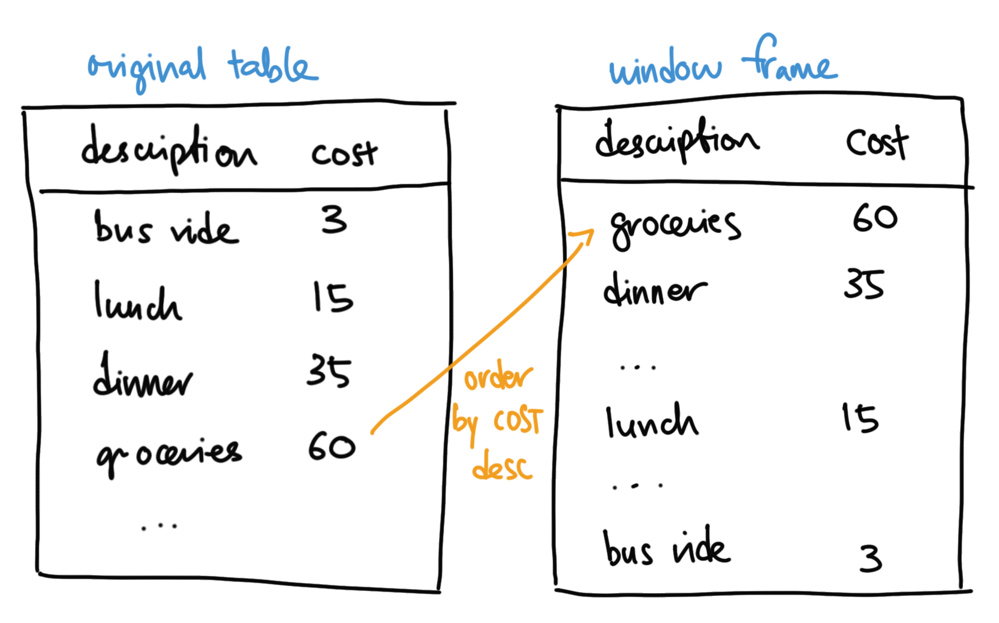
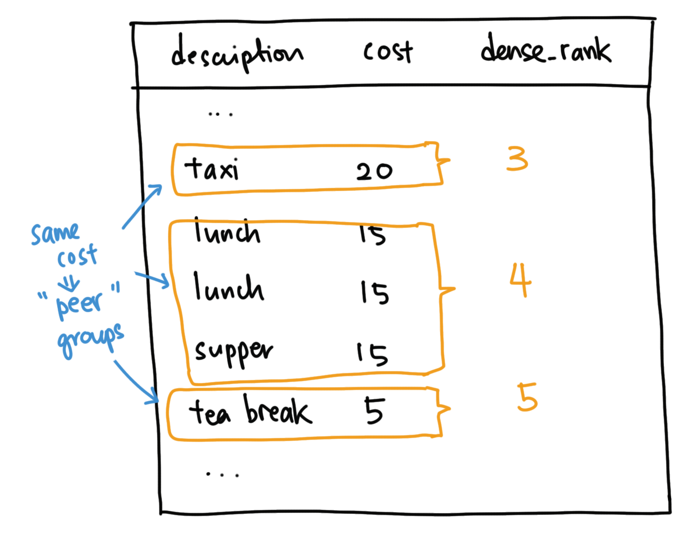
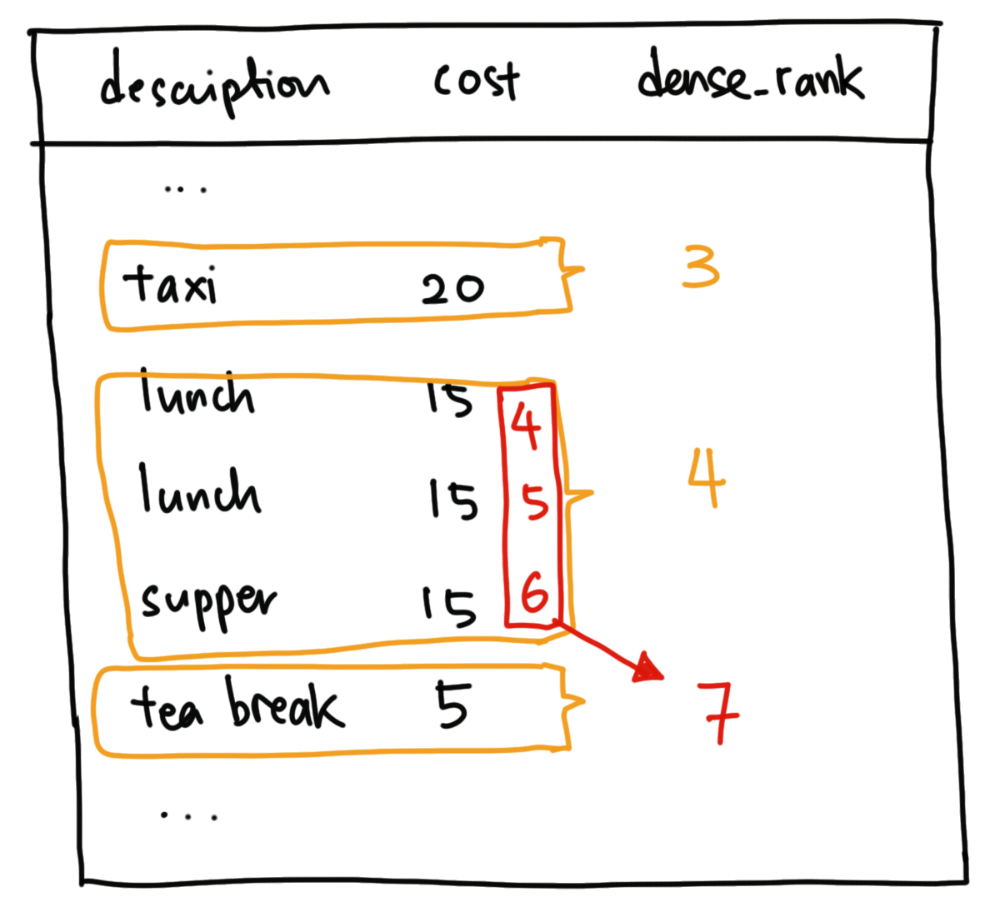

Leading from an [introduction to Window Function Calls](/blog/window-function-calls-an-introduction/), let's dive deeper into the different Window Functions that are available. Today, we'll look at `row_number`, `rank`, `dense_rank` and `percent_rank`. We'll be using the same expenses table from the previous post, which had entries like:

| description | cost |
| ----------- | ---- |
| bus ride    | 3    |
| lunch       | 15   |
| ...         |      |

In the following examples, our **window frame** will be the whole expenses table, ordered by highest to lowest cost:
```sql
SELECT
  [ window function ] OVER(ORDER BY cost DESC),
  expenses.description,
  expenses.cost
FROM expenses
```




## row_number
Let's start with `row_number`:
```sql
... ROW_NUMBER() OVER(ORDER BY cost DESC), ...
```

All `row_number` does is add a running number for each row in the frame, starting from 1:

| row_number | description | cost |
| ---------- | ----------- | ---- |
| 1          | groceries   | 60   |
| 2          | dinner      | 35   |
| 3          | taxi        | 20   |
| 4          | lunch       | 15   |
| 5          | lunch       | 15   |
| 6          | supper      | 15   |
| 7          | tea break   | 5    |
| 8          | bus ride    | 4    |
| 9          | bus ride    | 3    |
| 10         | bus ride    | 3    |


## dense_rank
`dense_rank` is more interesting. Reviewing the previous example, we can see that there were a few entries that have the same cost. The Postgres documentation refers to these as **peer groups**, and `dense_rank` adds a running number counting by the groups instead of rows:



So changing the SQL to this:
```sql
... DENSE_RANK() OVER(ORDER BY cost DESC), ...
```

Gives us this:

| dense_rank | description | cost |
| ---------- | ----------- | ---- |
| 1          | groceries   | 60   |
| 2          | dinner      | 35   |
| 3          | taxi        | 20   |
| 4          | lunch       | 15   |
| 4          | lunch       | 15   |
| 4          | supper      | 15   |
| 5          | tea break   | 5    |
| 6          | bus ride    | 4    |
| 7          | bus ride    | 3    |
| 7          | bus ride    | 3    |

**Note**: I'm actually not sure how Postgres orders the rows _within_ a peer group - in my small example, it looks like an implicit `ORDER BY ID DESC` was added, but the Postgres [docs](https://www.postgresql.org/docs/current/queries-order.html) also say for general ordering, _if sorting is not chosen, the rows will be returned in an unspecified order_ 🤷‍♂️.


## rank
`rank` has one big difference from `dense_rank` - it counts the "gaps" in the previous peer group:



Let's compare the results of each function to show the difference:

| dense_rank | rank | description | cost |
| ---------- | ---- | ----------- | ---- |
| 1          | 1    | ...         | ...  |
| 2          | 2    | ...         | ...  |
| 3          | 3    | ...         | ...  |
| 4          | 4    | ...         | ...  |
| 4          | 4    | ...         | ...  |
| 4          | 4    | ...         | ...  |
| 5          | 7    | ...         | ...  |
| 6          | 8    | ...         | ...  |
| 7          | 9    | ...         | ...  |
| 7          | 9    | ...         | ...  |


## percent_rank

This is an interesting one - how it's derived is a bit of a mouthful, so let's show by example, starting with the query:
```sql
... PERCENT_RANK() OVER(ORDER BY cost DESC), ...
```

And the result:

| percent_rank | description | cost |
| ------------ | ----------- | ---- |
| 0            | groceries   | 60   |
| 0.11...      | dinner      | 35   |
| 0.22...      | taxi        | 20   |
| 0.33...      | lunch       | 15   |
| 0.33...      | lunch       | 15   |
| 0.33...      | supper      | 15   |
| 0.66...      | tea break   | 5    |
| 0.77...      | bus ride    | 4    |
| 0.88...      | bus ride    | 3    |
| 0.88...      | bus ride    | 3    |

Instead of a running number, we get the "relative rank" from 0 to 1 inclusive. This is useful if you need to know how close something is to the highest rank - though, as the above example shows, it may not end with 1 if there are ties for the highest rank (a deeper explanation [here](https://dba.stackexchange.com/a/144015)).

## side-by-side

Finally, let's look at results side by side:

| row_number | dense_rank | rank | percent_rank | description | cost |
| ---------- | ---------- | ---- | ------------ | ----------- | ---- |
| 1          | 1          | 1    | 0            | groceries   | 60   |
| 2          | 2          | 2    | 0.11...      | dinner      | 35   |
| 3          | 3          | 3    | 0.22...      | taxi        | 20   |
| 4          | 4          | 4    | 0.33...      | lunch       | 15   |
| 5          | 4          | 4    | 0.33...      | lunch       | 15   |
| 6          | 4          | 4    | 0.33...      | supper      | 15   |
| 7          | 5          | 7    | 0.66...      | tea break   | 5    |
| 8          | 6          | 8    | 0.77...      | bus ride    | 4    |
| 9          | 7          | 9    | 0.88...      | bus ride    | 3    |
| 10         | 7          | 9    | 0.88...      | bus ride    | 3    |


I hope that helped! Here's an [sqlfiddle](http://sqlfiddle.com/#!17/d3ff0a/8) you can play around with.

In future articles, we'll look into more window functions. Follow me on Twitter to be informed of the next one!

